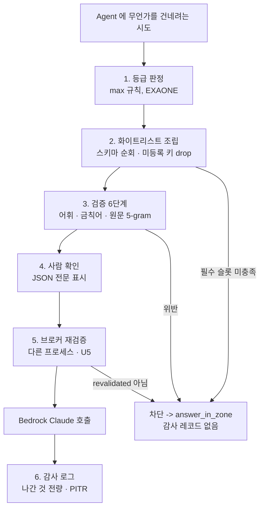

# U1 — NFR Design Patterns

---

## 1. Whitelist Assembly (화이트리스트 조립) — 이 설계의 중심 패턴

**문제**: 모델이 생성한 구조에서 원문이 새는 것을 어떻게 막는가.

**기각한 접근 (마스킹/블랙리스트)**
```
지울 것을 찾는다 -> 찾지 못한 것은 그대로 나간다 -> 실패가 조용히 일어난다
```

**채택한 패턴**
```python
# 스키마를 순회한다. 모델 출력을 순회하지 않는다.
for slot in schema.slots:
    if slot.name in raw:
        result[slot.name] = coerce(raw[slot.name], slot)
```

**속성**: `set(result) ⊆ schema.slot_names` — **모델이 무엇을 반환하든** 성립한다.
증명: `result`에 키가 추가되는 유일한 문장이 `slot.name`을 키로 쓰고, `slot ∈ schema.slots`이므로.

**적용 지점**: `extractor.assemble()`
**검증**: PB-3 (`adversarial_raw()` 생성기로 임의의 악의적 모델 출력 주입)

**왜 이게 패턴인가**: 루프의 방향이 보안 속성을 결정한다. 같은 결과를 내는 두 코드 중 하나는 "검사를 잊으면 유출"이고 다른 하나는 "잊을 검사가 없다."

---

## 2. Constrained Slot Filling (제약된 슬롯 채우기)

**문제**: LLM에게 구조를 만들게 하면 어휘를 벗어난다 (실측 확인).

**패턴**
```
1. 필드별 허용값 목록을 프롬프트에 명시적으로 나열
2. "__unknown__" 탈출구 제공 — 없는 정보를 만들어내지 않게
3. "Never quote the document" 명시 — 근거 설명하려 원문 인용하는 것을 막음
4. response_format: json_object + temperature 0
5. 응답은 조립 입력으로만 쓰고 그대로 사용하지 않는다
```

**실측 결과**: 3회 반복 모두 동일, 전부 in-vocab, 함정으로 심은 금액·인명 미포함.
반면 JSON 전체 생성 방식은 첫 시도에서 3개 필드 이탈.

**적용**: `extractor.py`, `classifier.exaone_tier` (등급도 enum 출력만)
**한계**: 모델이 슬롯 의미를 오해하면 **틀린 답**이 나온다. 유출은 아니지만 품질 문제. 인용 표시로 사용자가 검증 (설계 §3.8)

---

## 3. Fail Closed (실패는 닫는다)

**문제**: 오류 경로가 유출 경로가 되는 것을 막는다.

**패턴**: 모든 예외 핸들러의 기본 반환값이 **가장 안전한 값**이다.

```python
try:
    ex = await exaone_tier(text)
except (TimeoutError, ParseError, ValueError, httpx.HTTPError):
    return TierDecision(tier=Tier.SECRET, exaone_failed=True)   # 가장 높은 등급
```

**금지 패턴**
```python
except Exception:
    return Tier.OPEN        # 절대 금지
except Exception:
    pass                    # 절대 금지 (판정 없이 진행)
```

**적용**: 등급 판정, 구조 추출, 검증, 브로커 호출
**예외 1건**: `AuditLog.mirror()`만 fail-open (로컬이 원본이므로 증거 손실 없음)
**검증**: 각 실패 유형을 강제 주입하는 예제 테스트 6개

---

## 4. Two-Phase Approval (2단계 승인)

**문제**: 사람 확인을 UI의 매너가 아니라 구조로 강제한다.

**패턴**
```
POST /prepare  -> envelope 를 서버 메모리에 TTL 5분 보관, PreviewCard 반환
                  (Agent 호출 없음)
POST /send     -> envelope_id + approved_by 필수. 없으면 동작 불가
```

**속성**: 승인 없는 전송이 **구조적으로 불가능**하다. `send` 엔드포인트가 `envelope_id`를 요구하고, `envelope_id`는 `prepare`만 발급한다.

**적용**: `main.py` 라우팅 + `Gatekeeper.ask_agent` 전제조건
**부가 이득**: `prepare`가 멱등이라 사용자가 미리보기를 여러 번 볼 수 있고, `send`는 한 번만 성공한다 (캐시 소비)

---

## 5. Type-Enforced Invariants (타입으로 강제하는 불변식)

문서로 쓴 규칙은 지켜지지 않는다. 타입 시스템에 넣으면 지켜진다.

| 불변식 | 타입 표현 |
|---|---|
| 한 호출에 한 등급 | `AgentCall.tier: Tier` (`list[Tier]`가 아니다) |
| 페이로드에 원문 없음 | `PayloadEnvelope`에 `text` 필드 부재 |
| 매핑 비영속 | `Mapping.__getstate__` → `TypeError` |
| 인용에 경로 없음 | `Citation`에 `internal_path` 필드 부재 |
| 등급 상향이 `max()` | `Tier.__lt__` 구현 |
| 슬롯은 열거·정수·불리언만 | `SlotDef.kind: Literal["enum","int","bool"]` |

**`SlotDef.kind`에 `"str"`이 없는 것이 가장 강한 결정이다.** 자유 문자열 슬롯을 만들 수 없으므로 원문이 새어나갈 채널 자체가 존재하지 않는다.

**주의**: `Tier.__lt__`를 구현하지 않으면 `max()`가 알파벳 순으로 동작해 `secret < open`이 된다. 조용한 유출이므로 단위 테스트가 필수다.

---

## 6. Import Boundary Enforcement (import 경계 강제)

**문제**: "다른 파일에서 Claude 클라이언트를 import하지 않는다"는 코드 규칙이 지켜지는지.

**패턴**: 규칙을 **테스트로 만든다.**

```python
# tests/unit/test_import_boundary.py
ALLOWED_BOUNDARY_IMPORTERS = {"mesh.gatekeeper", "mesh.audit"}
FORBIDDEN = {"mesh.llm.broker", "boto3", "botocore"}

def test_no_module_bypasses_gatekeeper():
    for path in Path("src/mesh").rglob("*.py"):
        mod = module_name(path)
        if mod in ALLOWED_BOUNDARY_IMPORTERS or mod.startswith("mesh.llm"):
            continue
        for imported in imports_of(ast.parse(path.read_text())):
            assert imported not in FORBIDDEN, f"{mod} imports {imported}"
```

동일 패턴으로 `Chunk` 전파 경계와 `Mapping` 전파 경계도 검사한다.
**코드 리뷰 매너에 의존하지 않는다.** 5일 동안 3명이 작업하면 반드시 누군가 실수한다.

---

## 7. Defense in Depth — 6겹



**텍스트 대안**

```
Agent 에 무언가를 건네려는 시도
  1. 등급 판정 (max 규칙, EXAONE)
  2. 화이트리스트 조립 (스키마 순회, 미등록 키 drop)
       -> 필수 슬롯 미충족 시 차단
  3. 검증 6단계 (어휘, 금칙어, 원문 5-gram)
       -> 위반 시 차단
  4. 사람 확인 (JSON 전문 표시 + 승인)
  5. 브로커 재검증 (U5, 다른 프로세스)
       -> revalidated 아니면 차단
  Bedrock Claude 호출
  6. 감사 로그 (나간 것 전량, PITR)

차단 경로 -> answer_in_zone() -> 감사 레코드 없음
```

각 겹이 **독립적으로 작동**한다. ②의 버그를 ③이 잡고, ③의 버그를 ④가, ①~④ 전부의 실패를 ⑤가 잡는다.

**④가 성립하는 이유**: 페이로드가 2KB 이하 JSON이라 3초면 읽힌다. **표현을 작게 만든 것이 사람 검토를 실현 가능하게 만들었다.** 자유 텍스트 요약이면 이 겹은 실질적으로 작동하지 않는다.

---

## 8. Ephemeral Mapping (수명 제한 매핑)

**문제**: 매핑 테이블은 기호와 실제 이름의 사전이다. 유출되면 과거의 모든 감사 로그가 복호화된다.

**패턴**
1. `PayloadEnvelope`에 담지 않는다 (별도 메모리 캐시, `envelope_id` 키)
2. 직렬화 차단 (`__getstate__`/`__reduce__` → `TypeError`)
3. `try/finally`로 재수화 직후 폐기
4. `envelope` 캐시 TTL 5분 — 승인이 안 오면 자동 소멸
5. 로그에 절대 넣지 않는다 (로거 필터 금지 목록)

**검증**: `json.dumps`/`pickle.dumps`/`copy.deepcopy`에 대한 `TypeError` 테스트 + 감사 로그 스키마에 매핑 컬럼 부재 확인

---

## 9. Mock That Doesn't Lie (거짓말하지 않는 목업)

**문제**: 목업 모드가 검증을 우회하면 데모가 거짓이 된다.

**패턴**: 목업은 **LLM 응답만** 재생한다.

| 컴포넌트 | 목업 모드 |
|---|---|
| `ExaoneClient` | 픽스처 재생 |
| `BrokerClient` | 픽스처 재생 |
| `Extractor.assemble` | **실제 코드** |
| `Validator` 6단계 | **실제 코드** |
| `AuditLog` | **실제 코드** |
| `Rehydrator` | **실제 코드** |
| UI 표시 | **"목업 모드" 배지 표시** |

즉 목업 모드에서도 검증이 실제로 돌고, 검증 실패도 실제로 일어난다.
화면에 목업임을 표시해 심사자를 속이지 않는다.

---

## 10. Auditable Trust Boundary (감사 가능한 신뢰 경계)

**문제**: 이 프로젝트의 신뢰 경계는 환경변수 하나다. 그러면 그 값이 바뀌었는지 어떻게 아는가.

**패턴**: 감사 레코드에 `trusted_zone_llm_base_url`과 `transport`를 **매 질의 기록**한다.

```
2026-08-19 14:33:41 | person:choi | us.anthropic.claude-sonnet-4-5-... | transport=broker
  trusted_zone_llm=https://api.friendli.ai/dedicated/v1
  tier=secret | representation=structured | 1.1KB | sha256=9f2a... | 검증 6/6 | 승인=person:choi
```

**효과**
1. "원문이 어디로 갔는지"가 로그로 증명된다
2. 설정이 바뀌면 로그에 남는다 — 누군가 몰래 엔드포인트를 바꿔도 발각된다
3. 실배포로 전환했을 때 로그가 그 사실을 기록한다

`preflight`가 이 값이 공개 SaaS면 경고를 띄운다 (`[!] Trust boundary is SIMULATED`).
숨기지 않고 드러내는 것이 이 프로젝트의 신뢰성을 높인다.

---

## 11. 패턴 적용 요약

| 패턴 | 파일 | 검증 |
|---|---|---|
| Whitelist Assembly | `extractor.assemble` | PB-3 |
| Constrained Slot Filling | `extractor`, `classifier` | 예제 3회 반복 + PB-4 |
| Fail Closed | 전 모듈 | 실패 주입 테스트 6개 |
| Two-Phase Approval | `main.py`, `gatekeeper.ask_agent` | 승인 없는 send 실패 테스트 |
| Type-Enforced Invariants | `schemas.py` | PB-7, PB-8, PB-9 |
| Import Boundary | `tests/unit/test_import_boundary.py` | CI 필수 |
| Defense in Depth | ①~⑥ 전체 | 각 겹 독립 테스트 |
| Ephemeral Mapping | `Mapping`, `gatekeeper` | 직렬화 `TypeError` 테스트 |
| Mock That Doesn't Lie | `llm/*.py` 목업 경로 | 목업 모드에서 검증 실패 재현 |
| Auditable Trust Boundary | `audit.py`, `preflight.py` | 감사 레코드 필드 확인 |
