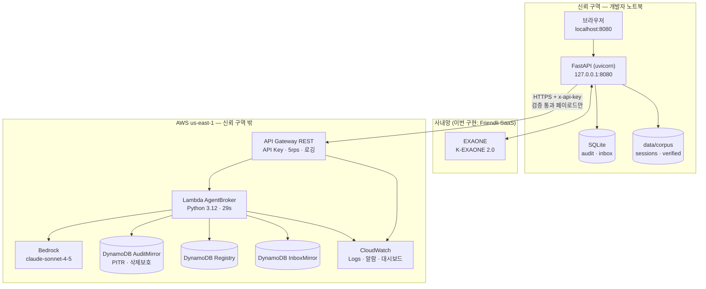

# U5 — Deployment Architecture

---

## 1. 배포 토폴로지



**텍스트 대안**

```
신뢰 구역 — 개발자 노트북
  브라우저(localhost:8080) -> FastAPI(127.0.0.1:8080)
  FastAPI -> SQLite (audit, inbox)
  FastAPI -> data/corpus, sessions, verified  (원문)
  FastAPI <-> EXAONE  (사내망. 이번 구현은 Friendli SaaS)

  ==== 경계 ====  HTTPS + x-api-key, 검증 통과 페이로드만

AWS us-east-1 — 신뢰 구역 밖
  API Gateway REST (API Key, 5rps, 액세스/실행 로깅)
    -> Lambda AgentBroker (Python 3.12, 29s, 동시성 5)
         -> Bedrock (claude-sonnet-4-5)
         -> DynamoDB AuditMirror (PITR, 삭제보호, PutItem 만)
         -> DynamoDB Registry (읽기)
         -> DynamoDB InboxMirror (쓰기)
         -> CloudWatch Logs (90일)
  API Gateway -> CloudWatch Logs (90일)
```

---

## 2. 경계를 넘는 데이터

| 방향 | 내용 | 넘지 않는 것 |
|---|---|---|
| 노트북 → API GW | 검증 통과 페이로드 · 시스템 프롬프트 · 모델 ID · SHA-256 | **원문 · 매핑 테이블 · 세션 원문 · 파일 경로** |
| Lambda → Bedrock | 위와 동일 | 동일 |
| Lambda → DynamoDB | 감사 레코드 (페이로드 사본) · 인박스 항목 중 `tier==open`인 것 | 나머지 |
| API GW → 노트북 | ref 기반 응답 · `revalidated` 플래그 | |

**시스템 프롬프트가 경계를 넘는다.** 페르소나 프롬프트에 `"김철수 책임"`, `"인증 아키텍처"` 같은 것이 들어간다. 이건 `agents.yaml`에 본인이 작성한 공개 정보이므로 의도된 것이다. 단 `agents.yaml`에 고객사명·기밀을 넣지 않는 것을 규칙으로 둔다 — 프롬프트도 게이트키퍼 검증 대상에 포함한다 (`check_banned`).

---

## 3. 환경 구성

환경은 **하나뿐이다** (`prod`). 5일 해커톤에 dev/staging을 만들지 않는다.

| 설정 | 값 |
|---|---|
| 스택 이름 | `MeshHubStack`, `MeshBrokerStack`, `MeshObsStack` |
| API 스테이지 | `prod` |
| 리전 | `us-east-1` |
| 태그 | `Project=prompthon`, `Owner=hackathon-team`, `Ephemeral=true` |

`Ephemeral=true` 태그가 "이건 지워도 되는 리소스"임을 표시한다. 워크샵 계정 정리 시 도움이 된다.

---

## 4. 로컬 앱의 전송 모드

```
AGENT_TRANSPORT=direct     (기본, CDK 없이 동작)
  노트북 -> boto3 bedrock-runtime.Converse -> Bedrock
  자격증명: .kiro/.env 의 임시 STS  <- 만료 위험
  검증: 로컬 1회만
  감사: SQLite 만

AGENT_TRANSPORT=broker     (CDK 배포 후 권장)
  노트북 -> HTTPS + x-api-key -> API GW -> Lambda -> Bedrock
  자격증명: 노트북에 AWS 자격증명 불필요  <- 만료 없음, 이식성
  검증: 로컬 + Lambda 2회       <- 다층 방어
  감사: SQLite + DynamoDB       <- 지울 수 없는 증거

AGENT_TRANSPORT=mock       (오프라인 데모)
  노트북 -> data/fixtures 재생
  검증: 로컬 1회 (실제로 동작한다)
  감사: SQLite 만
```

**데모에서는 `broker`를 쓴다.** 방어가 한 겹 더 두껍고 감사 증거력이 강하다는 것을 설명할 수 있다.
**`direct`는 안전망이다.** 워크샵 계정이 회수되거나 CDK 배포가 늦어도 데모가 살아 있다.

전환은 환경변수 하나 + 앱 재시작. 코드 변경 없다.

---

## 5. 배포 순서와 의존

```
1. cdk bootstrap                  (Day 0, 한 번만)
2. make bundle-lambda             validator.py, schemas.py, vocab.json 복사
3. cdk deploy MeshHubStack        DynamoDB 3개
4. cdk deploy MeshBrokerStack     Lambda + API GW (Hub 의 테이블 ARN 참조)
5. cdk deploy MeshObsStack        알람 (Broker 의 함수/API 참조)
6. Secrets Manager 에서 API Key 조회 -> 로컬 .env
7. make preflight                 broker 모드 왕복 확인
8. AGENT_TRANSPORT=broker         전환
```

`cdk deploy --all`이 3~5를 의존 순서대로 처리한다.

**`vocab.json` 동결 이후에 배포하는 것이 중요하다.** Day 1에 동결하고 Day 2~3에 배포하면 재배포 횟수가 줄어든다. 어휘 사전이 바뀌면 반드시 `make bundle-lambda && cdk deploy MeshBrokerStack`을 다시 해야 한다.

**방어**: Lambda가 응답에 `vocab_sha256`을 포함하고 로컬이 자기 것과 비교한다. 다르면 로그에 경고 + `/api/health`에 표시. 차단하지는 않는다 (데모를 죽이지 않기 위해).

---

## 6. 관측과 시연

| 화면 | 용도 |
|---|---|
| CloudWatch Dashboard `MeshBrokerDashboard` | 시연 중 호출 수·지연·오류를 실시간으로 보여줄 수 있다 |
| DynamoDB 콘솔 `AuditMirror` | **"우리 앱이 지울 수 없는 감사 기록"을 콘솔에서 직접 보여준다** |
| CloudWatch Logs Insights | 검증 실패 이력 조회 |

**데모 활용**: 감사 로그 탭에서 0건을 보여준 다음, DynamoDB 콘솔로 넘어가 "이건 우리 앱이 삭제 권한을 갖지 않은 테이블입니다"를 보여주면 증거력이 한 단계 올라간다. IAM 정책도 함께 보여준다 (`PutItem`만 있음).

Logs Insights 쿼리 예시
```
fields @timestamp, tier, stage, envelope_id
| filter metric = "validation_failure"
| sort @timestamp desc
```

---

## 7. 실패 모드와 복구

| 실패 | 증상 | 복구 |
|---|---|---|
| CDK 부트스트랩 실패 (IAM 권한) | `bootstrap` 오류 | `--cloudformation-execution-policies` 조정. 안 되면 `direct` 모드로 진행 |
| STS 자격증명 만료 | `ExpiredToken` | 워크샵 콘솔에서 재발급 → `.kiro/.env` 갱신. `broker` 모드면 **배포 시에만** 필요 |
| Lambda 콜드 스타트 | 첫 호출 3~5초 | 시연 직전 워밍업 호출 1회 |
| Lambda 타임아웃 | 29초 | Bedrock이 25초를 넘는 일은 없다(실측 2.2s). 발생하면 `direct`로 전환 |
| API Key 유출 | 4xx 알람 | Usage Plan에서 키 비활성 + 새 키 생성 |
| 검증 실패 알람 | `ValidationFailureAlarm` | **로컬 코드 버그.** 즉시 조사 (정상 동작에서는 발생하지 않는다) |
| Bedrock 쿼터 초과 | `ThrottlingException` | `daily_limit` 하향 + 모델을 haiku로 전환 |
| 워크샵 계정 회수 | 전체 실패 | `AGENT_TRANSPORT=mock` → 녹화 응답으로 데모 |
| DynamoDB 쓰기 실패 | 미러 지연 | **무시.** 로컬이 원본 (BR-A-05 fail-open) |

**모든 실패 경로가 `direct` 또는 `mock`으로 귀결된다.** 클라우드가 데모의 단일 실패점이 아니다.

---

## 8. 정리 (해커톤 종료 후)

```bash
cd infra && npx aws-cdk@2 destroy --all
```

| 리소스 | 삭제 여부 |
|---|---|
| Lambda · API GW · 알람 · 대시보드 | 자동 삭제 |
| `AgentRegistry` · `InboxMirror` | 자동 삭제 |
| **`AuditMirror`** | **`RETAIN` — 남는다.** 삭제 보호를 끄고 콘솔에서 수동 삭제 |
| CloudWatch 로그 그룹 | 90일 후 자동 만료 |
| CDK 부트스트랩 (`CDKToolkit`) | 남긴다 (다른 실습에 쓰일 수 있다) |

**추가 조치 (SECURITY-12)**
- Friendli API 키 폐기·재발급
- `.kiro/.env`의 AWS 자격증명은 어차피 만료된다
- 저장소를 공개할 경우 히스토리에 자격증명이 없는지 재확인 (`git log -p | grep -iE 'flp_|ASIA'`)

---

## 9. 실배포로 갈 때 달라지는 것 (참고)

이 MVP를 실제로 도입한다면 다음이 필요하다. **이번 범위 밖**이지만 설계가 그 방향을 막지 않는다는 것을 보이기 위해 기록한다.

| 항목 | 변경 |
|---|---|
| EXAONE 엔드포인트 | `TRUSTED_ZONE_LLM_BASE_URL`을 사내 서빙으로. **환경변수 1개** (OpenAI 호환이면 코드 변경 0) |
| 권한 관리 | **원본 시스템 ACL 승계가 최우선 요건.** 없으면 권한 우회 도구가 된다 |
| 다중 노트북 | Hub 스택이 이미 준비돼 있다. 각 노트북이 Edge로 등록되고 재수화는 각자의 신뢰 구역에서 |
| API 인증 | API Key → IAM SigV4 또는 사내 IdP |
| 네트워크 | VPC + PrivateLink (Bedrock VPC 엔드포인트). SECURITY-07이 N/A에서 적용으로 바뀐다 |
| UI 호스팅 | 사내망 내부 서버. **클라우드에 올리지 않는다** (재수화된 답변이 지나가므로) |
| 어휘 사전 | task별 확장. **보안팀과 함께 정의** |
| 감사 | 별도 계정 + Object Lock S3로 이전 |

**첫 번째 항목이 이 프로젝트의 핵심 주장이다.** 신뢰 경계의 위치가 설정값이므로, 경계를 지키는 구조를 그대로 두고 경계만 옮길 수 있다.
