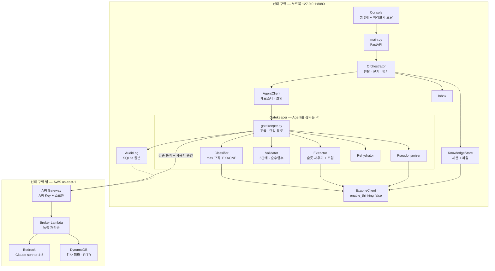

# Application Design — 통합

이 문서는 `components.md`, `component-methods.md`, `services.md`, `component-dependency.md`를 하나로 묶은 요약이다. 상세는 각 문서 참조.

---

## 1. 설계를 한 문장으로

**컴포넌트 경계를 신뢰 경계와 일치시키고, 경계를 넘는 통로를 코드 수준에서 2개로 못 박는다.**

보안이 정확성 요건인 프로젝트에서 "조심하자"는 규율은 실패한다. 5일 동안 3명이 동시에 손대면 반드시 누군가 실수한다. 그래서 이 설계의 모든 결정은 **실수해도 유출 경로가 없게** 만드는 데 맞춰져 있다.

| 위험 | 규율로 막는 방식 (채택 안 함) | 구조로 막는 방식 (채택) |
|---|---|---|
| 어휘 사전 밖 값이 나간다 | 프롬프트를 잘 쓴다 | **코드가 화이트리스트로 조립.** 미등록 키는 조립 단계에서 버려진다 |
| 원문이 Agent에 간다 | 리뷰에서 잡는다 | **타입 시스템.** `PayloadEnvelope`에 원문 필드가 없다 |
| 다른 모듈이 Bedrock을 부른다 | 코딩 규칙 문서 | **import 검사 테스트**가 CI에서 실패시킨다 |
| 승인 없이 전송된다 | UI가 모달을 띄운다 | **API 2단계 분리.** `send`가 `envelope_id`+`approved_by` 없이는 동작 안 함 |
| 등급이 섞인다 | 개발자가 주의한다 | **`tier`가 단일값 타입.** 섞인 페이로드는 생성 시점에 실패 |
| 매핑 테이블이 남는다 | 폐기를 잊지 않는다 | **직렬화 차단** (`__getstate__`에서 `TypeError`) |

---

## 2. 아키텍처 개요



**텍스트 대안**

```
신뢰 구역 — 노트북 127.0.0.1:8080
  Console(탭 3개 + 미리보기 모달) -> main.py(FastAPI) -> Orchestrator
  Orchestrator -> KnowledgeStore(세션 + 파일)
  Orchestrator -> AgentClient(페르소나 · 초안)
  Orchestrator -> Inbox
  AgentClient  -> Gatekeeper
  Gatekeeper   -> Classifier / Extractor / Validator / Pseudonymizer / Rehydrator
  Classifier, Extractor, Pseudonymizer, KnowledgeStore -> ExaoneClient
  Gatekeeper   -> AuditLog(SQLite, 원본)

  ==== 경계를 넘는 통로 2개 ====
  Gatekeeper.ask_agent()  (검증 통과 + 사용자 승인이 전제조건)
  AuditLog.mirror()       (위 페이로드의 사본)

신뢰 구역 밖 — AWS us-east-1
  API Gateway(API Key + 스로틀) -> Broker Lambda(독립 재검증)
  Broker Lambda -> Bedrock(Claude sonnet-4-5)
  Broker Lambda -> DynamoDB(감사 미러, PITR, 삭제 방지)
```

---

## 3. 컴포넌트 요약

| 컴포넌트 | 파일 | 한 줄 | 소유 | 레이어 |
|---|---|---|:---:|:---:|
| **Gatekeeper** | `gatekeeper.py` | Agent를 감싸는 막. 유일한 외부 통로 | A | 4 |
| Classifier | `classifier.py` | `max(규칙, EXAONE)`. 실패 시 secret | A | 3 |
| Extractor | `extractor.py` | 슬롯 채우기 + **코드가 조립** | A | 3 |
| Validator | `validator.py` | 6단계. **순수 함수** | A | 1 |
| Pseudonymizer | `pseudonymizer.py` | 식별자만 치환, 기술 용어 보존 | A | 3 |
| Rehydrator | `rehydrator.py` | 기호 → 실제 이름. **순수 함수** | A | 1 |
| AuditLog | `audit.py` | 나간 것 전량 + 원문 검색 | A | 4 |
| KnowledgeStore | `store.py` | 세션 + 파일 직접 읽기 | B | 5 |
| AgentClient | `agent.py` | Claude 대리인. 설정만 다른 단일 구현 | B | 5 |
| Orchestrator | `orchestrator.py` | 전달 · 신뢰도 분기 · 병기. **모델 안 부름** | B | 6 |
| Inbox | `inbox.py` | 초안 + 3버튼 + 환류 | B | 5 |
| Console | `web/` | 탭 3개 + 미리보기 모달 + 원문 검색 | C | 7 |
| ExaoneClient | `llm/exaone.py` | Friendli 호출. `reasoning*` 삭제 | A | 2 |
| BrokerClient | `llm/broker.py` | broker/direct/mock 전환 | A | 2 |
| SchemaRegistry | `schemas.py` | **Day 1 동결. 3인의 계약** | A | 0 |
| Config | `config.py` | 환경변수 + `agents.yaml`. 절대 경로 금지 | A | 0 |

---

## 4. 대안과 기각 이유

| 대안 | 기각 이유 |
|---|---|
| **컴포넌트를 설계 문서대로 8개 파일에 유지** | `gatekeeper.py` 하나에 판정·추출·검증·가명화를 다 넣으면 SECURITY-11(보안 로직 격리) 위반이고, `validator.py`를 Lambda에 번들할 수 없어 다층 방어가 성립하지 않는다. 대신 `gatekeeper.py`가 로직 없이 조율만 하게 해서 이해 비용을 낮췄다 |
| **`/api/ask` 단일 엔드포인트** | 사람 확인(FR-09)이 UI의 매너에 의존한다. 2단계로 나눠야 승인 없는 전송이 구조적으로 불가능해진다 |
| **모든 것을 클라우드로** | 원문과 매핑 테이블이 경계를 넘는다. 보안 모델 자체가 무너진다 |
| **모든 것을 로컬로 (CDK 없음)** | STS 자격증명이 만료되고, 감사 로그를 앱이 지울 수 있어 증거력이 약하다. 컴퓨터를 바꿀 때 AWS 자격증명 재설정이 필요하다 |
| **벡터 DB + 임베딩 (설계 §4.7)** | 지목을 사람이 하므로 검색이 필요 없다. `scenarios.md` §0에서 세션+파일로 확정됐다. 의존성 하나를 줄이는 것이 5일 일정에서 실질적 이득 |
| **Agent 간 직접 통신** | 순환과 토큰 폭발로 디버깅 불가 (설계 §4.4.7) |
| **모델이 JSON 전체 생성 (설계 §3.4)** | **실측에서 어휘 사전을 벗어났다.** 슬롯 채우기 + 코드 조립으로 대체 |
| **LLM으로 상충 여부 판정** | 오탐이 잦다. 둘 다 맞을 수 있다. `divergent`만 표시하고 판단은 사람에게 남긴다 |

---

## 5. 아키텍처 스타일

| 항목 | 선택 | 근거 |
|---|---|---|
| 전체 스타일 | **로컬 모놀리스 + 얇은 서버리스 사이드카** | 5일 · 3명. 마이크로서비스의 운영 비용을 감당할 수 없다 |
| 로컬 프로세스 수 | 1개 (FastAPI) | 디버깅 단순 |
| 계층화 | 8레이어 단방향 의존 | 순환 방지, PBT 대상 식별 |
| 상태 | SQLite + JSON 파일 | 의존성 최소. 감사 로그와 인박스만 DB 필요 |
| 프론트엔드 | 빌드 없는 단일 HTML + 바닐라 JS | 빌드 파이프라인이 5일 일정을 먹는다 |
| 비동기 | `asyncio` (2개 대상 병렬 호출) | 30초 상한 |
| 오류 정책 | **fail closed** | 판정 실패 → secret, 검증 실패 → 차단. 예외: 감사 미러만 fail-open |

---

## 6. 설계 완전성 점검

| 요구사항 그룹 | 담당 컴포넌트 | 상태 |
|---|---|:---:|
| FR-01~15 게이트키퍼 | Gatekeeper + Classifier + Extractor + Validator + Pseudonymizer + Rehydrator + AuditLog | ✅ |
| FR-16~22 지식 저장소 | KnowledgeStore | ✅ |
| FR-23~28 Agent | AgentClient | ✅ |
| FR-29~37 Orchestrator | Orchestrator | ✅ |
| FR-38~44 인박스·화면 | Inbox + Console | ✅ |
| FR-45~49 폴백·목업 | ExaoneClient + BrokerClient + `Gatekeeper.answer_in_zone` | ✅ |
| FR-50~55 데이터·평가 | U6 (`data/`, `tests/eval/`) | ✅ |
| NFR-S-01~15 보안 | 전 컴포넌트 + U5 인프라 | ✅ (N/A 3건 문서화) |
| NFR-T-01~08 PBT | `tests/property/`, `tests/generators.py` | ✅ (N/A 2건 문서화) |
| NFR-PO-01~06 이식성 | Config + `Makefile` + `scripts/preflight.py` | ✅ |

**미매핑 요구사항 없음.**

---

## 7. 다음 단계

- 유닛 분해: `unit-of-work.md`
- 유닛별 상세 설계: `aidlc-docs/construction/{unit}/`
- 코드 생성 계획: `aidlc-docs/construction/plans/{unit}-code-generation-plan.md`
