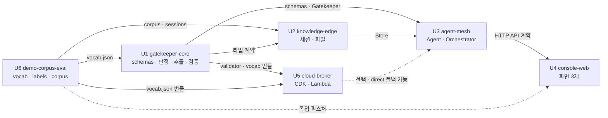

# Unit of Work — Dependency

---

## 1. 의존 행렬

행 = 의존하는 쪽. **H** = 강한 의존 (없으면 진행 불가) · **S** = 약한 의존 (스텁으로 우회 가능) · **C** = 계약만 공유

| | U1 | U2 | U3 | U4 | U5 | U6 |
|---|:--:|:--:|:--:|:--:|:--:|:--:|
| **U1** gatekeeper-core | — | | | | | **H** |
| **U2** knowledge-edge | C | — | | | | **H** |
| **U3** agent-mesh | **H** | **H** | — | | S | S |
| **U4** console-web | | | C | — | | S |
| **U5** cloud-broker | **H** | | | | — | **H** |
| **U6** demo-corpus-eval | S | | | | | — |

### 강한 의존 상세

| 의존 | 무엇이 필요한가 | 없으면 |
|---|---|---|
| U1 → U6 | `vocab.json` (어휘 사전) | 추출기를 만들 수 없다 |
| U2 → U6 | `data/corpus/**`, `data/sessions/*.json` | 읽을 파일이 없다 |
| U3 → U1 | `Gatekeeper` 인터페이스 + `schemas.py` | Agent를 호출할 통로가 없다 |
| U3 → U2 | `KnowledgeStore.load_session/read` | 지식을 꺼낼 수 없다 |
| U5 → U1 | `validator.py` + `schemas.py` (Lambda 번들) | 독립 재검증을 못 한다 |
| U5 → U6 | `vocab.json` (Lambda 번들) | 재검증 기준이 없다 |

### 계약 의존 (C) 상세

| 의존 | 계약 | 우회 방법 |
|---|---|---|
| U2 → U1 | `Chunk`, `Session`, `Tier` 타입 | Day 1 `schemas.py` 동결로 해소 |
| U4 → U3 | 8개 HTTP 엔드포인트의 요청/응답 스키마 | `services.md`가 계약. C는 목업 JSON으로 먼저 UI를 만든다 |

---

## 2. 임계 경로

```
U6 (vocab.json 초안) --> U1 (schemas.py 동결) --> U3 --> U4
                                 |
                                 +--> U5
```

**임계 경로 길이**: U6 → U1 → U3 → U4 = 4단계.
**병목**: U1. 소유자 A의 작업량이 가장 크고 U3·U5가 둘 다 U1을 기다린다.

### 병목 완화 (설계 §7.3의 지적)

> "Day 2 종료 시 Gatekeeper 인터페이스가 스텁이라도 나와야 B가 Day 3에 막히지 않는다."

**Day 1에 U1의 스텁을 먼저 커밋한다.** 구현은 비어 있고 시그니처와 타입만 있는 상태.

```python
# Day 1 커밋: src/mesh/gatekeeper.py
class Gatekeeper:
    def classify(self, text, source_path=None) -> TierDecision:
        raise NotImplementedError  # A: Day 2
    async def ask_agent(self, env, persona, approved_by) -> AgentResponse:
        raise NotImplementedError  # A: Day 2
    ...
```

B는 Day 3에 이 시그니처에 대고 코딩하고, A가 Day 2에 구현을 채운다.
C는 Day 4에 목업 JSON으로 UI를 만들다가 실제 API로 갈아탄다.

---

## 3. 병렬 가능 구간

```
Day 1  ┌── U6: vocab.json + labels.json 스키마 + 코퍼스 착수     [C]
       ├── U1: schemas.py + config.py + 스텁 + .gitignore        [A]
       └── U2: 세션 JSON 3개 + store.py 로더                      [B]
       *** 동결: schemas.py + vocab.json + agents.yaml + API 계약 ***

Day 2  ┌── U1: 판정 · 추출 · 검증 · 가명화 · 감사  (전체 작업량의 최대)  [A]
       ├── U6: 코퍼스 40~60건 + labels.json 완성                       [C]
       └── U5: cdk bootstrap + 스택 골격                               [A 또는 B 여유분]
       *** 게이트 G2: 기밀 재현율 100% — 미달 시 Day 3 진입 금지 ***

Day 3  ┌── U3: agent.py · orchestrator.py · inbox.py · main.py    [B]
       ├── U2: 파일 읽기 · 경로 선택 · verified 병합               [B]
       └── U5: 브로커 배포 완료 + 감사 미러                        [A]
       *** 게이트 G3: 시나리오 1 종단 통과 (CLI로 확인) ***

Day 4  ┌── U4: 화면 3개 + 미리보기 모달 + 원문 검색               [C]
       ├── U6: questions.json + 목업 픽스처 녹화                   [C]
       └── U1/U3: 버그 수정 · PBT 보강                             [A,B]

Day 5  전원: 통합 · 유출 전수 검사 · 3막 리허설 · 백업 녹화
       *** 게이트 G4: 유출 0건 · G5: 목업 모드 3막 통과 ***
```

**Day 2가 가장 위험하다.** U1 하나에 작업량이 몰려 있고 게이트 G2가 여기 걸려 있다. A가 막히면 프로젝트가 막힌다.

**Day 2 리스크 완화**
- U1 작업 순서를 **규칙 기반 판정 → 검증기 → 추출기** 순으로 한다. 규칙 기반 판정만으로도 기밀 재현율 100%가 나올 가능성이 높다 (경로 `customer-*/**` + 헤더 + 사전). EXAONE 보조 판정은 그 다음
- 검증기는 순수 함수라 EXAONE 없이 개발·테스트 가능 → 병렬화됨
- 추출기가 늦어지면 `secret` 경로만 `answer_in_zone` 폴백으로 두고 시나리오 2(사내 가명화)를 먼저 시연 가능한 상태로 만든다

---

## 4. 유닛 간 계약 상세

### C1 — `schemas.py` (U1 → 전체)

```python
class Tier(StrEnum):
    OPEN = "open"; INTERNAL = "internal"; SECRET = "secret"
    def __lt__(self, other): ...   # max() 를 위한 순서

class Freshness(StrEnum):
    LIVE = "live"; STALE = "stale"; EXPIRED = "expired"

class Chunk(BaseModel):
    chunk_id: str
    entity_id: str
    text: str                  # 원문. 경계를 넘지 않는다
    tier: Tier
    display_title: str         # UI 표시용
    internal_path: str         # 로컬 전용. API 응답에 넣지 않는다
    section: str | None
    as_of: date | None
    formality: Literal["official", "informal"]

class SlotDef(BaseModel):
    name: str
    kind: Literal["enum", "int", "bool"]
    allowed: list[str] | None = None
    min: int | None = None
    max: int | None = None
    required: bool = True

class TaskSchema(BaseModel):
    schema_id: str
    domain: str
    question_template: str
    answer_format: dict[str, str]
    entity_roles: list[str]
    slots: list[SlotDef]
    @property
    def slot_names(self) -> frozenset[str]: ...

class PayloadEnvelope(BaseModel):
    envelope_id: str
    tier: Tier                 # 단일값. 등급 혼합 불가
    task_schema_id: str
    payload: dict              # 조립된 것. 원문 필드 없음
    validation: ValidationResult | None = None
    # mapping 은 여기 없다 — 별도로 메모리에만 보관

class AgentResponse(BaseModel):
    answer: dict
    confidence: float
    citations: list[str]       # ref 라벨
```

### C2 — HTTP API (U3 → U4)

`services.md` §1의 8개 엔드포인트. C는 이 스키마로 목업 JSON을 만들어 UI를 선행 개발한다.

### C3 — 브로커 계약 (U1 → U5)

`services.md` §3의 요청/응답. `revalidated: true`가 없으면 로컬이 fail closed.

### C4 — `vocab.json` (U6 → U1, U5)

```json
{
  "slots": {
    "auth_mechanism_class": {"kind":"enum","allowed":["password","challenge_response","certificate","biometric","token_bearer"]},
    "session_binding":      {"kind":"enum","allowed":["required","optional","none"]},
    "renewal_mode":         {"kind":"enum","allowed":["explicit","background_silent","none"]},
    "credential_reuse_allowed": {"kind":"bool"},
    "max_session_hours":        {"kind":"int","min":0,"max":8760},
    "credential_lifetime_hours":{"kind":"int","min":0,"max":8760},
    "role":                 {"kind":"enum","allowed":["external_requirement","our_component","constraint","goal"]}
  },
  "tasks": ["constraint_conflict_check"],
  "domains": ["authentication","data_pipeline","deployment"],
  "question_templates": ["conflict_and_mitigation","rationale_lookup","technique_lookup"],
  "_intentionally_absent": [
    "금액", "계약번호", "인명", "고객사명",
    "p99_latency_ms", "throughput_tps",
    "성능 수치 일반 — 시나리오 3의 폴백이 여기서 발생한다"
  ]
}
```

`_intentionally_absent`는 주석 역할이다. **새 task를 추가할 때 이 목록을 먼저 읽게** 만드는 장치이며, 어휘 사전을 늘릴 때 무엇을 넣지 말아야 하는지 상기시킨다 (NFR-M-03).

---

## 5. 롤백과 부분 실패

| 실패 | 영향 | 대응 |
|---|---|---|
| **U5(CDK)가 안 올라간다** | Agent 호출 경로 없음 | `AGENT_TRANSPORT=direct` — 노트북에서 Bedrock 직접 호출. **데모에 영향 없음** |
| **워크샵 계정 회수** | Bedrock 접근 불가 | `AGENT_MODE=mock` — 녹화 응답 재생. 화면에 목업 표시 |
| **Friendli 엔드포인트 중단** | 등급 판정·추출 불가 | `EXAONE_MODE=mock`. 규칙 기반 판정은 여전히 동작 |
| **U4(화면)가 늦다** | 시연 불가 | CLI 데모 스크립트로 3막 재생 (`make demo`) |
| **U6 코퍼스가 늦다** | 평가·데모 불가 | 시나리오별 최소 파일(부록의 8개)을 먼저 만든다 |
| **U1 추출기가 늦다** | `secret` 경로 불가 | `secret`은 `answer_in_zone` 폴백. 시나리오 2(사내 가명화)를 먼저 시연 |

**설계 원칙**: 어떤 유닛이 실패해도 **데모의 어떤 막은 살아남는다.** 단일 실패점을 만들지 않는다.

---

## 6. 의존 그래프



**텍스트 대안**

```
U6 --(vocab.json)--> U1
U6 --(corpus, sessions)--> U2
U6 --(vocab.json 번들)--> U5
U6 -.(목업 픽스처).-> U4
U1 --(schemas, Gatekeeper)--> U3
U1 --(타입 계약)--> U2
U1 --(validator, vocab 번들)--> U5
U2 --(Store)--> U3
U3 --(HTTP API 계약)--> U4
U5 -.(선택, direct 폴백 가능).-> U3

임계 경로: U6 -> U1 -> U3 -> U4
```
