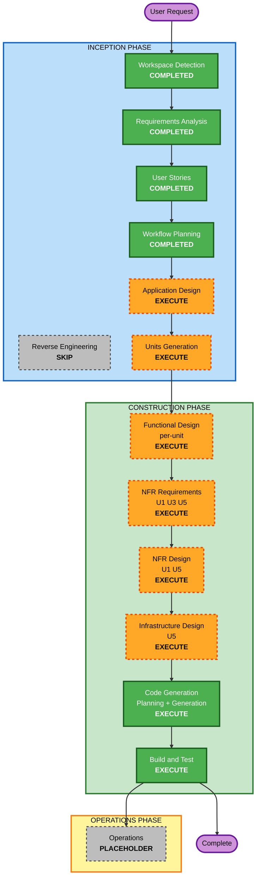

# Execution Plan

**작성**: 2026-08-19 · **프로젝트 유형**: Greenfield
**사용자 지시**: "이 질문이 끝나면 바로 구현작업에 들어갈 수 있도록" → INCEPTION 전 단계와 CONSTRUCTION 설계 단계를 **한 번에 실행**하고, 승인 게이트를 Code Generation Part 2 진입 앞에 둔다.

---

## 1. Detailed Analysis Summary

### 1.1 Change Impact Assessment

| 영역 | 해당 | 내용 |
|---|:---:|---|
| **User-facing changes** | Yes | 웹 UI 탭 3개(질문·인박스·감사 로그) 신규. 전송 미리보기 모달이 핵심 상호작용 |
| **Structural changes** | Yes | 신뢰 경계를 가로지르는 2계층 아키텍처를 새로 만든다. 경계가 곧 아키텍처다 |
| **Data model changes** | Yes | Session, Chunk, Payload, TaskSchema, Vocabulary, AuditRecord, InboxItem, VerifiedQA |
| **API changes** | Yes | 로컬 FastAPI 8개 엔드포인트 + 클라우드 브로커 REST API 3개 |
| **NFR impact** | Yes (지배적) | 보안이 기능 요건. 인터넷 노출 엔드포인트 신설. 30초 지연 상한 |

### 1.2 Risk Assessment

| 항목 | 판정 |
|---|---|
| **Risk Level** | **Medium-High** |
| **Rollback Complexity** | Easy (그린필드, `cdk destroy`로 클라우드 정리) |
| **Testing Complexity** | Complex — 유출 부재를 증명해야 한다. 예제 테스트로는 불가능해서 PBT + 전수 검사 필요 |

**최대 리스크 3개와 대응**

| # | 리스크 | 대응 | 담당 |
|---|---|---|---|
| 1 | **모델 엔드포인트 접속 실패로 데모가 죽는다** | ✅ **이미 해소.** 두 엔드포인트 실측 완료(`preflight-findings.md`). 추가로 목업 모드(FR-48) + `direct` 폴백(FR-49) | A |
| 2 | **기밀 재현율 100%를 못 맞춘다** | Day 2 하드 게이트. 규칙 기반을 먼저 강하게(경로·헤더·사전·정규식) 만들고 EXAONE은 보조. 못 넘기면 Day 3 진입 금지 | A |
| 3 | **`schemas.py`/`vocab.json` 동결이 늦어 3인 병렬이 막힌다** | **Day 1 종료 시 동결.** U1의 첫 산출물이 스텁 인터페이스여도 커밋된다 | A |

### 1.3 검증된 기술 전제

설계 이전에 실측했다 (`aidlc-docs/construction/preflight-findings.md`).
설계 문서 대비 **4가지 변경**이 발생했고, 이는 계획에 반영돼 있다.

| # | 변경 | 영향받는 유닛 |
|---|---|---|
| 1 | `claude-sonnet-5` → `us.anthropic.claude-sonnet-4-5-20250929-v1:0` | U3, U5 |
| 2 | 구조 추출을 **슬롯 채우기 + 코드 조립**으로 (모델의 어휘 이탈 실측 확인) | U1 |
| 3 | Bedrock 호출을 **Lambda 브로커**로 이전 (STS 만료·이식성) | U3, U5 |
| 4 | EXAONE `enable_thinking:false` 고정 + `reasoning*` 삭제 (원문 유출 채널) | U1 |

---

## 2. Workflow Visualization



**텍스트 대안**

```
INCEPTION PHASE
  Workspace Detection      COMPLETED
  Reverse Engineering      SKIP        (greenfield)
  Requirements Analysis    COMPLETED
  User Stories             COMPLETED
  Workflow Planning        COMPLETED
  Application Design       EXECUTE
  Units Generation         EXECUTE

CONSTRUCTION PHASE
  Functional Design        EXECUTE     (per-unit: U1 U2 U3 U4 U6)
  NFR Requirements         EXECUTE     (U1 U3 U5)
  NFR Design               EXECUTE     (U1 U5)
  Infrastructure Design    EXECUTE     (U5)
  Code Generation          EXECUTE     (all units)
  Build and Test           EXECUTE

OPERATIONS PHASE
  Operations               PLACEHOLDER
```

---

## 3. Phases to Execute

### INCEPTION PHASE

- [x] **Workspace Detection** — COMPLETED
- [x] **Reverse Engineering** — SKIPPED
  - **Rationale**: 그린필드. `requirements/`의 마크다운 2건은 설계 입력이고 분석할 코드가 아니다
- [x] **Requirements Analysis** — COMPLETED (Comprehensive)
  - **Rationale**: 보안이 정확성 요건이라 추적 가능한 요구사항이 필요하다. 55개 FR + 34개 NFR 생성
- [x] **User Stories** — COMPLETED
  - **Rationale**: 사용자 유형 6개, 사용자 워크플로 영향 큼, 수용 기준이 그대로 데모 대본이 된다. 3인 협업의 공통 이해 필요. `scenarios.md`가 이미 스토리에 가까운 형태였다
- [x] **Workflow Planning** — COMPLETED
- [x] **Application Design** — EXECUTE
  - **Rationale**: 신규 컴포넌트 전부. 컴포넌트 경계 자체가 보안 경계이므로 인터페이스를 먼저 못 박아야 한다. 특히 `ask_agent`가 유일한 외부 호출 지점이라는 규칙은 설계 시점에 정해져야 강제된다
- [x] **Units Generation** — EXECUTE
  - **Rationale**: 3인이 5일간 병렬로 작업한다. 유닛 경계 = 소유권 경계. 6개 유닛으로 분해

### CONSTRUCTION PHASE

| 스테이지 | U1 gatekeeper-core | U2 knowledge-edge | U3 agent-mesh | U4 console-web | U5 cloud-broker | U6 demo-corpus-eval |
|---|:---:|:---:|:---:|:---:|:---:|:---:|
| **Functional Design** | EXECUTE | EXECUTE | EXECUTE | EXECUTE | SKIP | EXECUTE |
| **NFR Requirements** | EXECUTE | SKIP | EXECUTE | SKIP | EXECUTE | SKIP |
| **NFR Design** | EXECUTE | SKIP | SKIP | SKIP | EXECUTE | SKIP |
| **Infrastructure Design** | SKIP | SKIP | SKIP | SKIP | EXECUTE | SKIP |
| **Code Generation** | EXECUTE | EXECUTE | EXECUTE | EXECUTE | EXECUTE | EXECUTE |

**SKIP 근거**

| 유닛 | 스테이지 | 근거 |
|---|---|---|
| U1 | Infrastructure Design | 신뢰 구역 안에서만 돈다. 배포할 인프라가 없다 (로컬 프로세스 + SQLite) |
| U2 | NFR Requirements / NFR Design | 성능·확장성 요건이 없다. 파일 수십 개를 읽는다. 보안 요건은 전부 U1 게이트키퍼가 담당하고, U2는 원문을 U1에만 넘긴다 |
| U2, U3, U4, U6 | Infrastructure Design | 로컬 실행. 배포 대상 없음 |
| U3 | NFR Design | 회복력·보안 패턴이 U1(검증·폴백)과 U5(레이트 리밋·격리)에 이미 설계된다. U3에 중복 설계하면 두 곳이 갈린다 |
| U4 | NFR Requirements / NFR Design | 정적 파일 + fetch. 성능 요건 없음. 보안 헤더(NFR-S-04)는 U4 기능 설계에 직접 포함 |
| U5 | Functional Design | 비즈니스 로직이 없다. 검증 재실행 + Bedrock 호출 + 감사 기록의 얇은 계층. 규칙은 U1의 `validator`를 공유한다 |
| U6 | NFR Requirements / NFR Design | 데이터와 테스트 하네스. 런타임 NFR 없음 |

- [ ] **Code Generation** — EXECUTE (ALWAYS, 유닛별)
- [ ] **Build and Test** — EXECUTE (ALWAYS, 전 유닛 완료 후)

### OPERATIONS PHASE

- [ ] **Operations** — PLACEHOLDER

---

## 4. 유닛 실행 순서

`unit-of-work-dependency.md`의 의존 관계에서 도출.

```
Day 1  U6(스키마·어휘 확정 협업) ──┬──> U1 (스텁 인터페이스 커밋)
                                   └──> U2 (세션 로더)
       *** Day 1 종료: schemas.py + vocab.json 동결 (3인 계약) ***

Day 2  U1 (등급 판정 · 슬롯 추출 · 검증기 · 가명화 · 감사)   [A]
       U6 (코퍼스 40~60건 + labels.json)                    [C]
       U5 (CDK 부트스트랩 + 브로커 스택 골격)                [A/B]
       *** Day 2 종료 게이트: 기밀 재현율 100% (미달 시 Day 3 진입 금지) ***

Day 3  U3 (Agent 호출 · Orchestrator · 에스컬레이션)         [B]
       U2 (파일 읽기 · verified QA 병합)                     [B]
       U5 (브로커 배포 완료 + 감사 미러)                      [A]

Day 4  U4 (화면 3개 + 미리보기 모달 + 원문 검색)              [C]
       U6 (questions.json + 목업 픽스처 녹화)                 [C]

Day 5  전 유닛 통합 · 유출 전수 검사 · 데모 3막 리허설 · 백업 녹화
```

**병렬 가능 지점**: Day 2의 U1/U6/U5는 서로 막지 않는다. `schemas.py` 동결이 이걸 가능하게 하는 유일한 조건이다.

---

## 5. Estimated Timeline

| | |
|---|---|
| **총 유닛** | 6 |
| **실행 스테이지** | INCEPTION 5 + CONSTRUCTION 유닛별 설계 12 + 코드 생성 6 + 빌드/테스트 1 |
| **기간** | 5일 (Day 0 준비 완료) |
| **인원** | 3명 (A: U1+U5, B: U2+U3, C: U4+U6) |

---

## 6. Success Criteria

### Primary Goal
기밀 문서를 근거로 외부 AI가 유용한 답을 내면서, **원문이 신뢰 경계를 넘지 않았음을 검색으로 증명**한다.

### Key Deliverables
1. 동작하는 로컬 앱 (질문·인박스·감사 로그 3탭)
2. CDK로 배포된 Agent Broker + 감사 미러
3. 샘플 코퍼스 40~60건 + 등급 정답 라벨 + 어휘 사전
4. 평가 하네스 (분류 정확도 · 유출 전수 검사 · PBT)
5. 데모 3막 대본 + 백업 녹화

### Quality Gates (하드)

| 게이트 | 시점 | 기준 | 미달 시 |
|---|---|---|---|
| **G1** | Day 1 종료 | `schemas.py` + `vocab.json` 동결·커밋 | 병렬 작업 중단, 스키마 합의 우선 |
| **G2** | Day 2 종료 | **기밀 재현율 100%**, 등급 정확도 ≥ 90% | **Day 3 진입 금지** |
| **G3** | Day 3 종료 | 인용 0개 차단 동작, 시나리오 1 종단 통과 | UI 착수 지연 |
| **G4** | Day 5 | **유출 0건** (자동 5-gram 대조 + 육안 전수) | 데모 불가 |
| **G5** | Day 5 | 3막 전체가 목업 모드에서도 통과 | 백업 녹화로 대체 |

### 보안 게이트 (blocking, SECURITY-*)

| # | 항목 | 시점 |
|---|---|---|
| SG1 | `.gitignore`가 `git init` **전에** 존재 (자격증명 3종이 평문으로 있다) | Day 1 첫 커밋 전 |
| SG2 | 브로커 API에 인증(API Key) + 스로틀링 | U5 배포 전 |
| SG3 | Lambda 실행 역할에 와일드카드 리소스 없음 | U5 배포 전 |
| SG4 | 감사 테이블 삭제 방지 + PITR, 앱이 자기 로그를 못 지움 | U5 배포 전 |
| SG5 | 로그·감사에 원문·토큰·`reasoning*` 부재 | Day 5 |

---

## 7. 승인 게이트 위치

사용자가 "바로 구현작업에 들어갈 수 있도록"을 요청했으므로 설계 스테이지의 개별 승인 게이트를 병합하고, **Code Generation Part 2(실제 코드 생성) 진입 직전 한 곳**에 승인 게이트를 둔다.

```
[완료] Requirements -> Stories -> Workflow Planning -> Application Design
       -> Units Generation -> Functional/NFR/Infra Design
       -> Code Generation Part 1 (계획 수립)
                                    |
                          *** 승인 게이트 (현재 위치) ***
                                    |
[대기]                 Code Generation Part 2 (실제 코드 생성)
                                    |
                            Build and Test
```
