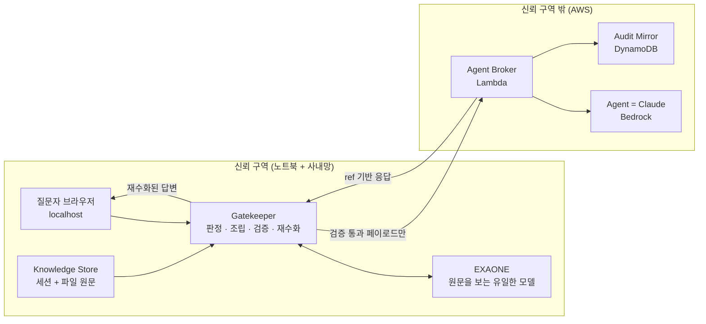

# Requirements — 대리 에이전트 메시 (Delegate Agent Mesh)

**작성**: 2026-08-19 · **깊이**: Comprehensive
**원천 문서**: `requirements/hackathon-mvp-design.md`, `requirements/scenarios.md`
**실측 근거**: `aidlc-docs/construction/preflight-findings.md`

---

## 1. Intent Analysis

| 항목 | 판정 |
|---|---|
| **User Request** | 상세 설계 문서 2건을 근거로, 즉시 구현에 착수할 수 있는 CONSTRUCTION 설계를 생성 |
| **Request Type** | New Project (Greenfield) |
| **Scope** | System-wide — 로컬 애플리케이션 + 클라우드 인프라 + 샘플 데이터 + 평가 하네스 |
| **Complexity** | Complex — 보안 불변식이 정확성 요건이고, 두 개의 이질적 LLM 백엔드를 신뢰 경계로 분리 |
| **Request Clarity** | Clear — 설계 의도·컴포넌트·시나리오·평가 기준이 원천 문서에 이미 상세히 정의됨 |
| **Risk Level** | Medium-High — 유출 1건이 곧 프로젝트 실패. 인터넷 노출 엔드포인트 신설. 워크샵 계정 회수 가능 |

### 이 프로젝트가 특이한 점

일반적인 프로젝트에서 보안은 비기능 요구사항이다. 여기서는 **보안이 기능 요구사항이다.**
"원문이 경계를 넘지 않는다"는 것이 부가 품질이 아니라 제품이 하는 일 자체다.
그래서 요구사항 구조도 그에 맞춘다 — 유출 방지가 NFR 섹션이 아니라 FR 섹션에 있다.

---

## 2. 문제 정의

| # | 문제 | 현재 벌어지는 일 | 이 시스템의 접근 |
|---|---|---|---|
| **P1** | 물어볼 사람을 찾고, 묻고, 기다린다 | 질문자는 대기하고 답변자는 하던 일이 끊긴다 | 사람 앞에 대리 에이전트를 세운다. 답할 수 있으면 사람은 대화를 알지도 못하고, 못 하면 요약·근거·초안이 붙어 도달한다 |
| **P2** | 기밀 자료는 외부 AI에 못 넣는다 | AI가 가장 도움이 될 자료가 정확히 못 넣는 자료다 | 자료 대신 **문제의 구조**만 경계 밖으로 보낸다. 어휘 사전이 나갈 수 있는 값의 전체 집합을 사전에 확정한다 |

**P1의 정확한 정의**: "누구에게 물어야 할지 모르겠다"가 아니다. **"아는 사람을 알지만, 물어보면 그 사람의 일이 끊긴다"** 다. 그래서 지목은 사람이 하고, 시스템은 전문성 매칭을 하지 않는다.

---

## 3. 신뢰 경계 — 모든 요구사항의 전제



**텍스트 대안 (다이어그램 파싱 실패 시)**

```
신뢰 구역 (노트북 + 사내망)
  질문자 브라우저(localhost) -> Gatekeeper
  Knowledge Store(세션 + 파일 원문) -> Gatekeeper
  Gatekeeper <-> EXAONE  (원문을 보는 유일한 모델)
        |
        | 검증 통과 페이로드만 경계를 넘는다
        v
신뢰 구역 밖 (AWS)
  Agent Broker(Lambda) -> Claude(Bedrock)
  Agent Broker -> Audit Mirror(DynamoDB)
  Agent Broker -> (ref 기반 응답) -> Gatekeeper
        |
        v
  Gatekeeper -> 재수화된 답변 -> 질문자 브라우저
```

### 경계를 넘는 지점은 정확히 두 개다

1. `Gatekeeper.ask_agent()` → Agent Broker (또는 direct 모드에서 Bedrock)
2. `Audit.mirror()` → DynamoDB (이미 ①을 통과한 페이로드의 사본)

**②는 ①의 부분집합이므로 새로운 유출 경로가 아니다.** 이것을 코드 규칙으로 못 박는다 — `gatekeeper.py`와 `audit.py` 외의 어떤 모듈도 경계 밖 클라이언트를 import하지 않는다.

### 이번 구현에서 성립하는 것과 성립하지 않는 것

| | 상태 |
|---|---|
| 원문이 `TRUSTED_ZONE_LLM` 엔드포인트 **하나**에만 전달된다 | ✅ 코드·검증기·감사 로그로 증명 |
| 그 엔드포인트가 **사내망 안에** 있다 | ❌ 이번 해커톤은 Friendli SaaS. **경계 위치는 환경변수 1개** |
| 실배포 전환 비용 | `TRUSTED_ZONE_LLM_BASE_URL` 변경 (OpenAI 호환이면 코드 변경 0) |

이 한계를 문서와 데모에서 먼저 밝힌다. 상세 근거: `preflight-findings.md` §5.

---

## 4. Functional Requirements

우선순위: **P0** = 없으면 데모가 성립하지 않음 · **P1** = 있어야 주장이 완성됨 · **P2** = 있으면 좋음

### 4.1 게이트키퍼 — 정보 흐름 통제 (프로젝트의 핵심)

| ID | 요구사항 | 우선 | 검증 방법 |
|---|---|:---:|---|
| **FR-01** | 텍스트와 출처 경로를 받아 보안 등급(`open`/`internal`/`secret`)을 판정한다. **규칙 기반 판정과 EXAONE 판정 중 높은 쪽을 채택**한다 | P0 | `labels.json` 대조, 기밀 재현율 100% |
| **FR-02** | 등급 판정이 실패·타임아웃하면 **`secret`으로 간주**한다. 어떤 경우에도 낮은 등급으로 폴백하지 않는다 | P0 | EXAONE 강제 타임아웃 주입 테스트 |
| **FR-03** | `secret` 등급 지식은 **어휘 사전이 허용한 값만 담은 구조 페이로드**로 변환한다. 원문 문장이 0개여야 한다 | P0 | 원문 5-gram 대조 0건 |
| **FR-04** | 페이로드는 **모델이 생성하지 않고 코드가 조립한다.** task 스키마에 선언된 슬롯만 순회하고, 모델이 반환한 미등록 키는 조립 단계에서 버린다 | P0 | 조립 불변식 PBT (`keys ⊆ schema.slots`) |
| **FR-05** | `internal` 등급 지식은 **가역적 가명화**로 변환한다. 고유명사·프로젝트명·경로만 placeholder로 치환하고 **기술 용어는 치환하지 않는다** | P0 | 가명화→재수화 왕복 항등 PBT |
| **FR-06** | placeholder는 **한 질의 안에서 일관**되어야 한다 (같은 대상 = 같은 번호) | P0 | 일관성 PBT |
| **FR-07** | 경계 밖으로 나가기 전 **6단계 검증**을 통과해야 한다: ①스키마 ②어휘 ③범위 ④금칙어 ⑤원문 5-gram 대조 ⑥크기(2KB) | P0 | 각 단계별 실패 케이스 테스트 |
| **FR-08** | 하나라도 실패하면 **Agent를 호출하지 않고** EXAONE 직접 답변으로 폴백한다 | P0 | 시나리오 3 후속 질문 재현 |
| **FR-09** | 전송 전 **나갈 내용 전문을 사용자에게 보여주고 명시적 승인**을 받는다. 승인 없이는 전송하지 않는다 | P0 | UI 미리보기 모달 |
| **FR-10** | 사용자 질문 자체도 등급 판정과 변환을 거친다. 지식만 막고 질문을 그대로 보내면 안 된다 (관문 ①) | P0 | 고객사명 포함 질문 테스트 |
| **FR-11** | **동원되는 지식 중 최고 등급이 호출 전체에 걸린다.** 질문이 `internal`이어도 읽은 파일에 `secret`이 있으면 전체가 `secret` | P0 | 시나리오 1 재현 |
| **FR-12** | 등급이 갈리는 질문은 **분해 가능하면 분해하고, 아니면 상향**한다. 한 번의 Agent 호출에는 **한 등급만** 담는다 | P1 | 시나리오 2 재현 + `AgentCall.tier` 단일값 불변식 |
| **FR-13** | Agent 응답의 참조 기호(`REQ_A` 등)를 **신뢰 구역 안에서** 실제 이름으로 되돌린다. 매핑 테이블은 앱 메모리에만 두고 응답 후 폐기한다 | P0 | 매핑 테이블 영속화 금지 테스트 |
| **FR-14** | EXAONE 호출은 **`enable_thinking: false`** 로 고정하고, 응답의 `reasoning*` 필드는 파싱 전에 삭제한다. 로그에도 남기지 않는다 | P0 | 응답 객체 키 검사 |
| **FR-15** | 경계 밖으로 나간 모든 페이로드를 **전량 보관**한다. 원문 문구로 검색해 0건임을 보여줄 수 있어야 한다 | P0 | 감사 로그 검색 UI |

### 4.2 지식 저장소 — 세션 + 파일

벡터 DB·임베딩·청크 인덱스를 **쓰지 않는다** (`scenarios.md` §0 확정 모델).
`hackathon-mvp-design.md` §4.7의 청크/코사인 유사도 서술은 그 결정 이전의 것으로 폐기한다.

| ID | 요구사항 | 우선 | 검증 방법 |
|---|---|:---:|---|
| **FR-16** | 사람별 세션 상태(`focus`, `summary`, `open_paths`, `recent_edits`, `recent_runs`, `datasets`)를 유지한다 | P0 | 세션 JSON 3개 로드 |
| **FR-17** | 질문에 관련된 파일을 **세션이 좁혀 놓은 후보 경로 중에서 고르고** 그 파일만 읽는다. 전역 검색을 하지 않는다 | P0 | 시나리오 1 ② 재현 |
| **FR-18** | 사람이 자리에 없어도 **마지막 세션 상태 + 파일 전체**로 답한다 | P0 | 시나리오 3 (최민수 부재) |
| **FR-19** | 세션 `updated_at` 경과에 따라 신선도를 3단으로 구분한다: 15분 이내 `live`, 15분~24h `stale`(신뢰도 ×0.8 + 시각 명시), 24h 초과 `expired`(실시간 주장에서 제외) | P1 | 시각 조작 테스트 |
| **FR-20** | 승인된 Q&A를 `data/verified/{entity_id}.json`에 영속 저장하고 세션 로드 시 병합한다. **등급을 함께 보존**하고, 이후 동원될 때 다른 지식과 똑같이 게이트키퍼를 통과시킨다 | P1 | 시나리오 2 ⑦ 환류 |
| **FR-21** | 세션 갱신은 실시간 데몬 없이 **미리 작성한 JSON + 시연 중 수동 갱신**으로 대체할 수 있어야 한다 (`scenarios.md` §0.4) | P0 | 데몬 없이 3막 전체 통과 |
| **FR-22** | 파일 경로는 **절대 경로를 저장하지 않는다.** `${MESH_DATA_ROOT}` 기준 상대 경로 + 치환 문법을 쓴다 | P0 | 다른 디렉터리로 복사 후 동작 |

### 4.3 Agent — Claude 대리인

| ID | 요구사항 | 우선 | 검증 방법 |
|---|---|:---:|---|
| **FR-23** | Agent는 **Bedrock의 Claude**다. 페르소나 프롬프트·지식 범위·에스컬레이션 대상만 다른 **단일 구현**이며, 사람마다 클래스를 나누지 않는다 | P0 | 에이전트 추가가 `agents.yaml` 한 항목 추가로 끝남 |
| **FR-24** | 답변에 **신뢰도**와 **인용**을 함께 반환한다 | P0 | 응답 스키마 검증 |
| **FR-25** | 시스템 프롬프트에 "받은 것은 실제 문서가 아니라 구조 요약이며, 대상은 참조 기호로 지칭하라"를 명시한다. 그래야 재수화가 성립한다 | P0 | 응답에 ref 사용 여부 검사 |
| **FR-26** | **1인칭으로 사람인 척하지 않는다.** 모든 답변에 "○○의 Agent" 라벨이 붙는다 | P0 | UI 라벨 + 프롬프트 |
| **FR-27** | 신뢰도가 낮으면 **에스컬레이션 초안**을 만든다: 질문 요약 + 지금까지 찾은 근거 + 답변 초안 | P0 | 시나리오 2 ⑥ 인박스 |
| **FR-28** | 모델 ID는 환경변수로 교체 가능해야 한다. 기본값 `us.anthropic.claude-sonnet-4-5-20250929-v1:0` | P0 | 모델 교체 테스트 |

### 4.4 Orchestrator — 전달과 분기

| ID | 요구사항 | 우선 | 검증 방법 |
|---|---|:---:|---|
| **FR-29** | **지목은 질문자가 한다.** 전문성 매칭·임베딩·브로드캐스트를 구현하지 않는다 | P0 | 코드에 라우팅 로직 부재 확인 |
| **FR-30** | 에이전트 목록에 담당 영역(본인 작성)을 표시하고, 활동 상태·오늘 질문 수·현재 작업 요약은 **에이전트별 opt-in** | P0 | `agents.yaml` `disclose:` 블록 |
| **FR-31** | `current_focus` 표시는 세션 원문이 아니라 **식별자를 제거한 요약**이며, 이 변환도 게이트키퍼를 통과한다 | P0 | 목록 응답에 고객사명 부재 |
| **FR-32** | 최대 **2명** 동시 지목. 병렬 호출 후 답을 병기한다 | P0 | 시나리오 3 |
| **FR-33** | 답이 갈리면 **하나를 조용히 고르지 않는다.** `divergent: true`로 양쪽을 `as_of`·`formality`와 함께 병기한다. 상충 여부를 자동 판정하지 않는다 | P0 | 시나리오 3 ④ |
| **FR-34** | 신뢰도 분기: ≥0.75 & 인용≥1 → 자동 응답 / 0.45~0.75 → `미검증` 배지 + 확인 요청 / <0.45 → 에스컬레이션 | P0 | 경계값 테스트 |
| **FR-35** | **인용 0개면 신뢰도와 무관하게 에스컬레이션.** 근거 없는 생성은 사용자에게 도달하지 않는다 | P0 | 인용 0개 강제 테스트 |
| **FR-36** | 에이전트 간 직접 호출 없음. 모든 조율은 Orchestrator를 거친다. 전체 30초 상한 | P0 | 타임아웃 테스트 |
| **FR-37** | 답 못 한 질문을 **지식 공백**으로 기록한다 | P2 | 로그 확인 |

### 4.5 인박스와 화면

| ID | 요구사항 | 우선 | 검증 방법 |
|---|---|:---:|---|
| **FR-38** | 인박스에 `[승인] [수정 후 승인] [내가 아님 → 다른 사람 지목]` 3버튼 | P0 | 시나리오 2 ⑥ |
| **FR-39** | `[내가 아님]` 지목 시 질문자 화면에 "○○이 △△를 지목했습니다 [다시 묻기]" | P1 | 시나리오 1 §4.4.3 |
| **FR-40** | 질문 탭: 지목 목록 → 질문 입력 → 답변. 출처·신뢰도·발신 에이전트·보안 등급 배지 표시 | P0 | 3막 전체 |
| **FR-41** | **Agent 전송 미리보기 모달** — 나갈 JSON 전문 + 검증 결과 + 포함되지 않은 것 목록 + `[전송]`/`[취소]` | P0 | 1막 결정적 장면 ① |
| **FR-42** | 감사 로그 탭 + **원문 검색 기능.** 원문 문구로 검색해 0건임을 보인다 | P0 | 1막 결정적 장면 ② |
| **FR-43** | 인용은 `display_title` + `section` + `tier` + `as_of`만 표시. **절대 경로·본문은 표시하지 않는다** | P0 | 응답에 `internal_path` 부재 |
| **FR-44** | 카운터: 방지된 인터럽트 건수 · 절감 추정 시간 | P2 | 시나리오 1 ⑪ |

### 4.6 폴백과 목업 (Resiliency 베이스라인 대체)

| ID | 요구사항 | 우선 | 검증 방법 |
|---|---|:---:|---|
| **FR-45** | EXAONE 미접속·타임아웃 → 등급을 `secret`으로 간주하고 사내 처리로 폴백 | P0 | 네트워크 차단 테스트 |
| **FR-46** | 구조 추출 JSON 파싱 실패 → **2회 재시도** → 실패 시 Agent 호출 없이 EXAONE 직접 답변 | P0 | 응답 조작 테스트 |
| **FR-47** | Bedrock/브로커 오류 → EXAONE 직접 답변 + 사용자에게 품질 저하 고지 | P0 | 브로커 중단 테스트 |
| **FR-48** | **목업 모드** (`EXAONE_MODE=mock`, `AGENT_MODE=mock`) — 녹화된 응답 재생으로 네트워크 없이 3막 전체가 돈다 | P0 | 오프라인 데모 리허설 |
| **FR-49** | `AGENT_TRANSPORT=direct|broker` — CDK 미배포 상태에서도 로컬에서 Bedrock 직접 호출로 동작 | P0 | 두 모드 모두 3막 통과 |

### 4.7 샘플 데이터와 평가

| ID | 요구사항 | 우선 | 검증 방법 |
|---|---|:---:|---|
| **FR-50** | 코퍼스 40~60건. 공식 문서만이 아니라 **개인 메모·스크립트·설정·실험 로그**를 반드시 섞는다 | P0 | 문서 종류 분포 확인 |
| **FR-51** | **엇갈리는 기록을 의도적으로 심는다** — 김책임 메모와 최민수 리뷰가 같은 사건을 다르게 서술 | P0 | 시나리오 3 |
| **FR-52** | **함정 문서** — 겉보기엔 일반 설계 문서인데 고객사 단가가 섞임 | P0 | 분류기가 `secret`으로 잡는지 |
| **FR-53** | `labels.json` 등급 정답 · `vocab.json` 어휘 사전 · `banned.json` 금칙어 · `questions.json` 데모 질문 | P0 | 평가 하네스 실행 |
| **FR-54** | **성능 수치 필드를 어휘 사전에 의도적으로 넣지 않는다** — 시나리오 3의 폴백이 여기서 발생 | P0 | 시나리오 3 ⑤ |
| **FR-55** | 평가 하네스: 기밀 재현율 · 등급 분류 정확도 · 유출 전수 검사 · 자동 응답률 · 인용 준수 | P0 | `make eval` |

---

## 5. Non-Functional Requirements

### 5.1 보안 (SECURITY-* 규칙 매핑)

| ID | 요구사항 | 규칙 | 대상 |
|---|---|---|---|
| **NFR-S-01** | 로컬 SQLite는 파일 권한 `0600`. DynamoDB는 **저장 시 암호화(AWS 관리 키)** 활성화. 모든 통신 TLS 1.2+ | SECURITY-01 | U1, U5 |
| **NFR-S-02** | API Gateway 스테이지에 **액세스 로깅 + 실행 로깅** 활성화 | SECURITY-02 | U5 |
| **NFR-S-03** | 구조화 로깅(JSON). 모든 로그에 `timestamp`, `correlation_id`, `level`, `message`. **원문·토큰·API 키를 절대 로그에 남기지 않는다** — `reasoning*` 필드 포함 | SECURITY-03 | 전체 |
| **NFR-S-04** | 로컬 웹 UI 응답에 `Content-Security-Policy: default-src 'self'`, `X-Content-Type-Options: nosniff`, `X-Frame-Options: DENY`, `Referrer-Policy: strict-origin-when-cross-origin` 설정. HSTS는 localhost HTTP에 N/A로 기록 | SECURITY-04 | U4 |
| **NFR-S-05** | 모든 API 입력을 **pydantic 스키마로 검증**. 질문 문자열 최대 4000자, 페이로드 최대 2KB, 지목 대상 최대 2개. 파일 경로는 `MESH_DATA_ROOT` 하위로 제한하고 **경로 탈출(`..`)을 거부** | SECURITY-05 | U1, U2, U5 |
| **NFR-S-06** | Lambda 실행 역할은 **`bedrock:InvokeModel`을 특정 추론 프로파일 ARN으로 한정**, DynamoDB는 특정 테이블 ARN으로 한정. 와일드카드 리소스 금지 | SECURITY-06 | U5 |
| **NFR-S-07** | VPC를 만들지 않는다(Lambda 퍼블릭). 네트워크 규칙이 없으므로 **N/A**로 기록하고, 대신 API Gateway 레이어의 인증·스로틀링으로 대체 | SECURITY-07 | U5 |
| **NFR-S-08** | 브로커 API는 **API Key + Usage Plan 필수**. 인증 없는 엔드포인트를 만들지 않는다. CORS는 `http://localhost:8080`만 허용(와일드카드 금지). 사용자 로그인은 이번 범위 밖이므로 객체 수준 인가는 **N/A**로 기록 | SECURITY-08 | U5 |
| **NFR-S-09** | 기본 자격증명 없음. 오류 응답은 일반화(스택 트레이스·내부 경로 노출 금지). S3 퍼블릭 액세스 차단. Python 3.12 / Lambda 최신 런타임 | SECURITY-09 | 전체 |
| **NFR-S-10** | `uv.lock` 커밋(정확한 버전 고정). `pip-audit` 또는 `uv`의 취약점 점검을 빌드 지시에 포함. **`.gitignore` 없이 첫 커밋 금지** — 자격증명 3종이 워크스페이스에 평문으로 있다 | SECURITY-10 | U1, U5 |
| **NFR-S-11** | 보안 로직을 `gatekeeper.py` / `validator.py` / `extractor.py`에 **격리**한다. 다른 모듈은 경계 밖 클라이언트를 import하지 않는다(코드 규칙 + 테스트로 강제). 브로커 Lambda가 **어휘 사전을 독립 재검증**해 다층 방어를 구성한다. 남용 시나리오: 프롬프트 인젝션으로 EXAONE이 원문을 슬롯값에 넣으려는 경우 → 어휘 사전 밖이므로 조립 단계에서 버려진다 | SECURITY-11 | U1, U5 |
| **NFR-S-12** | 소스·IaC에 **하드코딩된 자격증명 없음.** 브로커 API 키는 Secrets Manager, 로컬은 `.env`(gitignore). Friendli 토큰을 `opencode.jsonc`에서 환경변수로 이전. 해커톤 후 키 폐기·재발급. 사용자 인증이 없으므로 비밀번호 정책·MFA·세션 쿠키는 **N/A** | SECURITY-12 | U1, U5 |
| **NFR-S-13** | 신뢰할 수 없는 입력에 `json.loads`만 사용(`pickle`·`eval` 금지). 외부 CDN 스크립트를 쓰지 않는다(전부 로컬 정적 파일) → SRI **N/A**. 감사 로그에 행위자·시각·페이로드 해시 기록 | SECURITY-13 | U1, U4 |
| **NFR-S-14** | 검증 실패 건수에 **CloudWatch 알람**. DynamoDB 감사 테이블에 **삭제 방지 + 특정 시점 복구(PITR)** 활성화. Lambda 실행 역할에 `dynamodb:DeleteItem`·`logs:DeleteLogGroup` 부여 금지 — **애플리케이션이 자기 감사 로그를 지울 수 없어야 한다**. 로그 보존 90일 | SECURITY-14 | U5 |
| **NFR-S-15** | 모든 외부 호출(EXAONE·Bedrock·파일 I/O·DynamoDB)에 명시적 예외 처리. **실패 시 닫는다(fail closed)** — 판정 실패는 `secret`, 검증 실패는 전송 차단. FastAPI 전역 예외 핸들러 + 일반화된 사용자 오류 메시지 | SECURITY-15 | 전체 |

### 5.2 성능

| ID | 요구사항 | 근거 |
|---|---|---|
| **NFR-P-01** | 자동 응답 종단 지연 **≤ 30초** | 설계 §9 |
| **NFR-P-02** | EXAONE 왕복 실측 0.8~1.0s. 질의당 최대 3회(등급 판정·경로 선택·구조 추출) → **등급 판정은 규칙이 먼저 걸러 호출을 줄인다** | preflight §1 |
| **NFR-P-03** | Bedrock 왕복 실측 1.1~2.2s(sonnet-4-5). 에스컬레이션 초안은 haiku-4-5(0.9s)로 분리 | preflight §2 |
| **NFR-P-04** | 경로 선택 프롬프트에 **파일 본문을 넣지 않는다** (세션 요약만) | 설계 §6.2 |

### 5.3 이식성 (사용자 명시 요구)

| ID | 요구사항 |
|---|---|
| **NFR-PO-01** | 절대 경로 금지. 모든 데이터 경로는 `MESH_DATA_ROOT` 기준 상대 경로 |
| **NFR-PO-02** | `uv`로 Python 3.12 고정 + `uv.lock` 커밋. 시스템 Python(3.9.12)에 의존하지 않는다 |
| **NFR-PO-03** | CDK CLI를 전역 설치하지 않고 `npx aws-cdk@2` |
| **NFR-PO-04** | `aws` CLI에 의존하지 않는다 (현재 컴퓨터의 CLI가 `bedrock` 서비스를 모르는 구버전) |
| **NFR-PO-05** | `make setup` 원커맨드 부트스트랩 + `make preflight` 환경 검증 |
| **NFR-PO-06** | 샘플 코퍼스·세션·목업 픽스처를 저장소에 포함 — 새 컴퓨터에서 데이터 재생성 불필요 |

### 5.4 유지보수성

| ID | 요구사항 | 근거 |
|---|---|---|
| **NFR-M-01** | 애플리케이션 파일 수를 **작게 유지한다.** 세 사람이 동시에 손대려면 각자가 전체 구조를 머릿속에 담을 수 있어야 한다 | 설계 §6.1 |
| **NFR-M-02** | **Day 1 종료 시 `schemas.py`와 `vocab.json`을 동결**한다. 세 사람의 계약이며 이후 변경은 합의로만 | 설계 §7.3 |
| **NFR-M-03** | 새 task 유형을 추가할 때 **어휘 사전과 검증 규칙을 반드시 함께** 정의한다. "구조 추출을 거쳤으니 무엇이든 보내도 된다"는 논리를 금지한다 | 설계 §3.8 |

### 5.5 테스트 (PBT-* 규칙 매핑, Partial 모드)

| ID | 요구사항 | 규칙 |
|---|---|---|
| **NFR-T-01** | PBT 프레임워크로 **Hypothesis** 채택, `pyproject.toml`에 고정 버전으로 포함 | PBT-09 |
| **NFR-T-02** | **왕복 속성**: 가명화→재수화 = 항등. 페이로드 직렬화→역직렬화 = 항등 | PBT-02 |
| **NFR-T-03** | **불변식 속성**: ①조립된 페이로드의 키 ⊆ 스키마 슬롯 ②모든 문자열 값 ∈ 어휘 사전 ③원문의 어떤 5-gram도 페이로드에 없다 ④placeholder 일관성 ⑤`AgentCall.tier`는 단일값 | PBT-03 |
| **NFR-T-04** | **도메인 생성기**: `Chunk`, `Session`, `Payload`, `TierLabel`용 Hypothesis 전략을 `tests/generators.py`에 중앙화. 원시 타입 생성기만 쓰지 않는다 | PBT-07 |
| **NFR-T-05** | 시드 로깅 + shrinking 활성화. CI에서 시드를 매 실행 기록 | PBT-08 |
| **NFR-T-06** | PBT는 예제 기반 테스트를 대체하지 않는다. 3개 시나리오는 각각 **명시적 예제 테스트**를 갖는다 | PBT-10 |
| **NFR-T-07** | 상태 기반 PBT(PBT-06)는 5일 일정에서 제외 — **N/A**로 기록 | PBT-06 |
| **NFR-T-08** | 오라클 비교(PBT-05)는 참조 구현이 없으므로 **N/A**. 단 "EXAONE 단독 vs 구조추출+Agent" 품질 비교는 평가 하네스에 별도로 있다 | PBT-05 |

---

## 6. 성공 기준 (설계 §9 기반, 하드 게이트)

| 항목 | 측정 방법 | 목표 | 게이트 |
|---|---|---|:---:|
| **기밀 재현율** | `labels.json`의 기밀 문서 중 기밀로 분류된 비율 | **100%** | 🔴 Day 2 통과 필수 |
| **등급 분류 정확도** | 전체 문서 대비 정답 일치율 | ≥ 90% | 🔴 Day 2 |
| **유출 0건** | 감사 로그 전 페이로드 vs 기밀·사내 문서 5-gram 자동 대조 + 육안 전수 | **0건** | 🔴 Day 5 |
| **자동 응답률** | 사람 개입 없이 종결된 질의 비율 | ≥ 50% | 🟡 |
| **인용 준수** | 자동 응답 중 인용 1개 이상 비율 | **100%** (구조적 보장) | 🔴 |
| **외부 추론 실익** | EXAONE 단독 vs 구조추출+Agent 답변 품질 비교 | 후자 우세 | 🟡 데모 필수 |
| **응답 시간** | 자동 응답 기준 | ≤ 30초 | 🟡 |

**Day 2 게이트가 가장 중요하다.** 기밀 재현율 100%를 통과하지 못하면 Day 3으로 넘어가지 않는다 (설계 §7.2).

---

## 7. 명시적 범위 밖

| 항목 | 이유 |
|---|---|
| 실제 시스템 연동 (Confluence·Jira·메일·Git) | 코퍼스는 전부 우리가 만든 샘플 |
| 로그인·권한 관리 | 사용자는 드롭다운 전환. **실배포 시 원본 시스템 권한 승계가 최우선 요건** — 없으면 권한 우회 도구가 된다 |
| 벡터 DB·임베딩 | 지목은 사람이 하고 Store는 세션+파일 |
| 에이전트 간 다단 통신 | 순환과 토큰 폭발로 디버깅 불가 |
| 학습·파인튜닝 | |
| 실시간 알림 연동 | |
| 끝난 프로젝트를 대리하는 에이전트 | 사람만 대리한다 (설계 §10.2) |
| 실시간 파일시스템 감시 데몬 | 미리 작성한 세션 JSON + 수동 갱신으로 대체 (FR-21) |
| 다중 노트북 동시 참여 | Hub 스택이 구조적으로 준비되지만 이번 데모는 1대 |

---

## 8. 잔여 위험 (정직하게)

| 위험 | 완화 | 수용 여부 |
|---|---|---|
| **속성 조합에 의한 재식별** | 필드 수 상한, `domain`을 상위어로만, 사람 확인 | 잔여 위험 수용 |
| **질문 자체가 정보** | "이 조합이 충돌하는가"를 묻는 사실 자체 | **명시적으로 수용 결정** |
| **등급 판정 실패** | 규칙 병행 + 애매하면 상향 + 감사 로그로 사후 발견 | 완화 |
| **EXAONE 추출 오류** | 유출이 아니라 품질 문제. 인용 표시로 사용자가 검증 | 완화 |
| **신뢰 경계가 시뮬레이션** | 환경변수 1개로 실배포 전환. 데모에서 먼저 밝힌다 | **명시적으로 고지** |
| **워크샵 계정 회수** | `AGENT_TRANSPORT=direct` 로컬 모드가 항상 동작 | 완화 |
| **STS 자격증명 만료** | Lambda 실행 역할로 이전 + `make preflight`로 조기 발견 | 완화 |

> **팀에 못 박을 규칙**: "구조 추출을 거쳤으니 무엇이든 보내도 된다"는 논리를 금지한다.
> 구조 추출은 **어휘 사전이 통제하는 범위 안에서만** 안전하다.

---

## 9. 요구사항 → 시나리오 추적

| 시나리오 | 주요 검증 요구사항 |
|---|---|
| **1. 고객사 스펙 (기밀 경로)** | FR-01~04, 07, 09~11, 13, 15, 43 |
| **2. 학습 협업 (세션의 진가)** | FR-05, 06, 12, 16~20, 27, 38 |
| **3. 기억이 엇갈릴 때 (충돌·폴백)** | FR-08, 18, 32~35, 46, 54 |
