# 설계 자료 — MIA; But AI got you

> 무엇을 만들었고, 왜 그렇게 만들었는지. 다이어그램은 Mermaid 다.
> 사용법은 [`사용설명서.md`](./사용설명서.md) 에 있다.

---

## 0. 한 문장

**지식을 가진 사람 앞에 대리 에이전트를 세우고, 질문을 사람이 아니라 에이전트에게 보낸다.
기밀 자료는 신뢰 구역 안에서만 읽히고, 사외 AI 에는 데이터가 아니라 문제의 구조만 나간다.**

이 문서가 설명하려는 것은 기능 목록이 아니라 **이 주장이 코드로 어떻게 강제되는가**다.

---

## 1. 문제와 접근

### 1.1 무엇이 문제인가

| 지금 | 왜 안 되나 |
|---|---|
| 사람에게 슬랙으로 묻는다 | 상대를 깨운다. 답이 올 때까지 막힌다 |
| 사내 위키를 검색한다 | 최신 작업 상태는 위키에 없다 |
| 사외 AI 에 문서를 붙여 넣는다 | 기밀이 나간다. 되돌릴 수 없다 |

세 번째가 가장 유혹적이고 가장 위험하다. 이 프로젝트는 **세 번째를 안전하게 하는 것**을 목표로 한다.

### 1.2 접근 — 등급이 "쓸 수 있나"를 정하지 않는다

흔한 설계는 "기밀이면 사외 AI 금지"다. 그러면 정작 도움이 필요한 질문에서 도구가 쓸모없어진다.

이 프로젝트에서 등급이 정하는 것은 **어떤 표현으로 나가는가**다.

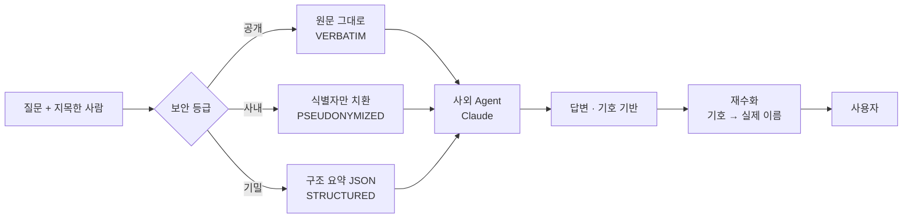

세 등급 모두 사외 추론의 도움을 받는다. 다른 것은 **무엇이 건너가는가**다.

### 1.3 비대칭 — 애매하면 항상 더 높은 등급

등급을 낮게 잡은 실수는 **유출**이고, 높게 잡은 실수는 **불편**이다.
비대칭이 명확하므로 모든 실패 경로가 `SECRET` + 신뢰 구역 내 처리로 귀결된다 (fail closed).

---

## 2. 시스템 구성

### 2.1 전체 구성

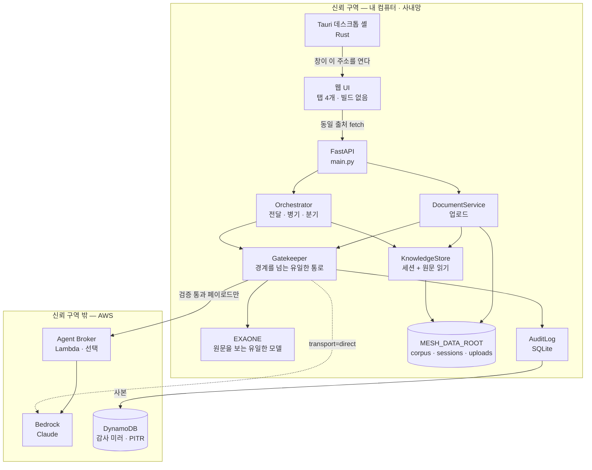

**경계를 넘는 화살표는 두 개뿐이다.** `Gatekeeper → Broker/Bedrock` 과 `AuditLog → DynamoDB`.
후자는 전자의 사본이다.

### 2.2 경계의 위치는 설정값 하나다

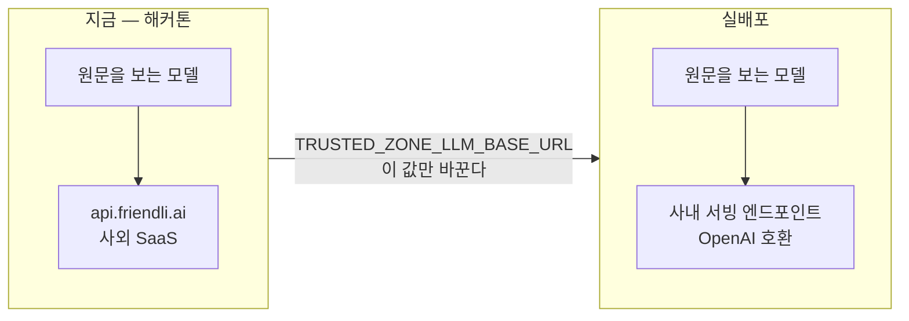

아키텍처가 보장하는 것은 **"원문이 이 엔드포인트 하나에만 전달된다"** 이고,
사내망 전환은 이 값을 바꾸는 것이다 (OpenAI 호환이면 코드 변경 0).

`trust_boundary_simulated` 가 `true` 인 동안 **화면 헤더가 그 사실을 상시 표시한다.**
숨기면 심사자를 속이는 것이고, 먼저 밝히는 것이 지적당하는 것보다 낫다.

감사 로그가 매 질의마다 이 값을 기록하므로 **원문이 어디로 갔는지가 로그로 증명된다.**

---

## 3. 핵심 흐름

### 3.1 문서 업로드 — 내 기밀 문서가 들어오는 지점

Day 4 에 생긴 새 입구다. 새 입구는 새 위험이므로 검사가 세 겹이다.

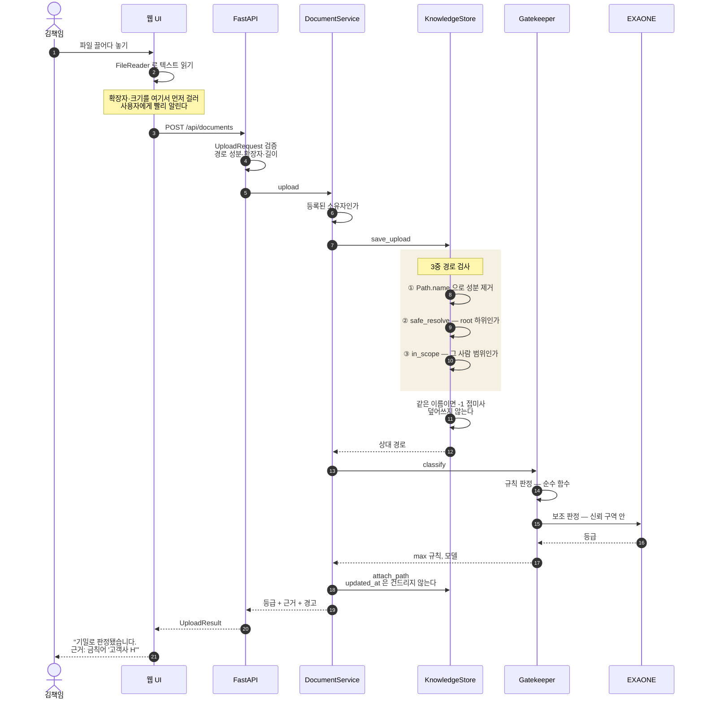

**왜 판정을 여기서 보여주는가**: 답이 무뎌졌을 때 "왜?"를 되짚을 수 있어야 하고,
등급 판정이 블랙박스가 아니라는 것을 이 화면 하나로 보일 수 있다.

**왜 `updated_at` 을 건드리지 않는가**: 파일을 올린 것은 "그 사람이 지금 그 일을 하고 있다"가
아니다. 되살리면 오래된 세션이 업로드 한 번으로 LIVE 가 되고, 신선도 보정이 무력화된다.

### 3.2 질문 — prepare 와 send 를 나눈다

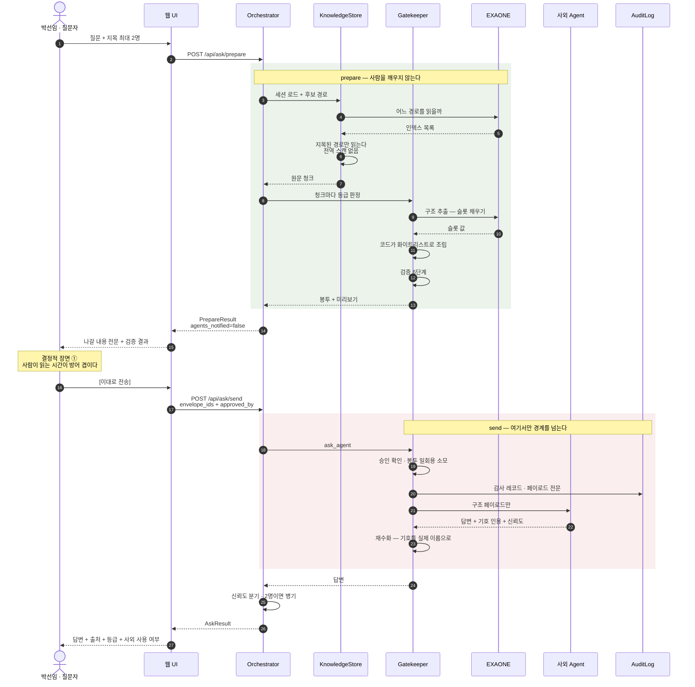

**왜 두 단계인가**: 한 번에 보내면 사용자가 무엇이 나가는지 볼 기회가 없다.
`PrepareResult.agents_notified` 는 **타입이 `False` 만 허용한다** — 이 단계에서 상대의
인박스에 아무것도 쓰지 않는 것이 코드로 못 박혀 있다.

`prepare` 는 감사 레코드도 남기지 않는다. 취소하면 흔적이 없다.

### 3.3 등급 판정 — 규칙 6단계 + 모델 보조

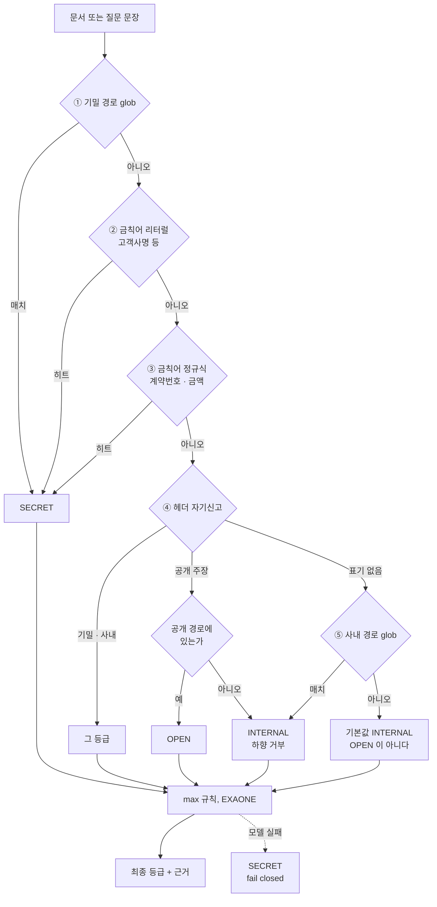

세 가지가 의도적이다.

1. **금칙어(②③)가 헤더 자기신고(④)보다 앞선다.** 그렇지 않으면 기밀 문서 맨 위에
   `보안 등급: 공개` 를 적는 것만으로 게이트키퍼를 통째로 우회할 수 있다.
2. **`OPEN` 은 헤더 표기 *그리고* 공개 경로를 함께 요구한다.** 하향 권한은 문서 작성자가
   아니라 배치 경로에 있다. 그래서 **업로드한 문서는 절대 `OPEN` 이 될 수 없다.**
3. **기본값이 `INTERNAL`.** 판정 못 한 문서를 `OPEN` 으로 두면 원문이 그대로 나간다.

`max()` 를 쓰기 때문에 EXAONE 은 등급을 **올릴 수만** 있다. 모델이 실패하면 `SECRET` 이다.

> ⚠️ `Tier` 는 `StrEnum` 이지만 4개 비교 메서드를 **명시적으로** 구현한다.
> 기본 비교가 알파벳 순이면 `max(INTERNAL, OPEN) == OPEN` 이 되어 상향이 유출로 바뀐다.
> `functools.total_ordering` 으로는 부족하다 — `str.__gt__` 가 남고 `max()` 는 그걸 쓴다.

### 3.4 페이로드 조립 — 방향이 중요하다

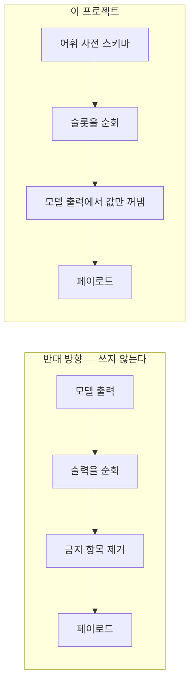

```python
for slot in schema.slots:          # 스키마를 순회한다
    if slot.name in raw:           # 모델 출력을 순회하지 않는다
        result[slot.name] = coerce(raw[slot.name], slot)
```

결과가 같아 보이지만 다르다. 반대 방향은 "검사를 잊으면 유출"이고,
이 방향은 **잊을 검사가 없다.** 어휘 사전에 없는 키는 애초에 조립되지 않는다.

실측: 모델에게 JSON 전체를 만들게 하면 첫 시도에서 어휘 사전 밖 필드 3개가 나왔다.
슬롯 채우기로 바꾸면 3회 반복 모두 in-vocab 이었다.

### 3.5 검증 6단계 — 순수 함수

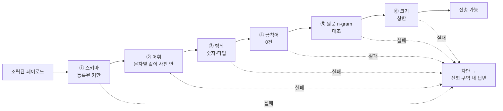

⑤가 가장 강력하다. **원문 문장이 한 조각이라도 페이로드에 있으면 기계적으로 잡힌다.**

단계마다 등급별 규칙이 다르다는 것이 중요하다.

| 표현 | ⑤ 검사 대상 |
|---|---|
| `STRUCTURED` (기밀) | 원문 5-gram 전체 |
| `PSEUDONYMIZED` (사내) | **식별자를 포함한** n-gram 만 |
| `VERBATIM` (공개) | 없음 — 원문 전송이 등급의 정의다 |

평탄한 규칙을 모든 등급에 적용했을 때 **오탐 1076건**이 났다. 목록이 그만큼 길면
아무도 읽지 않는다. 즉 가장 강력한 주장이 *실제 유출을 가리는 도구*가 되어 있었다.

### 3.6 신뢰도 분기와 병기

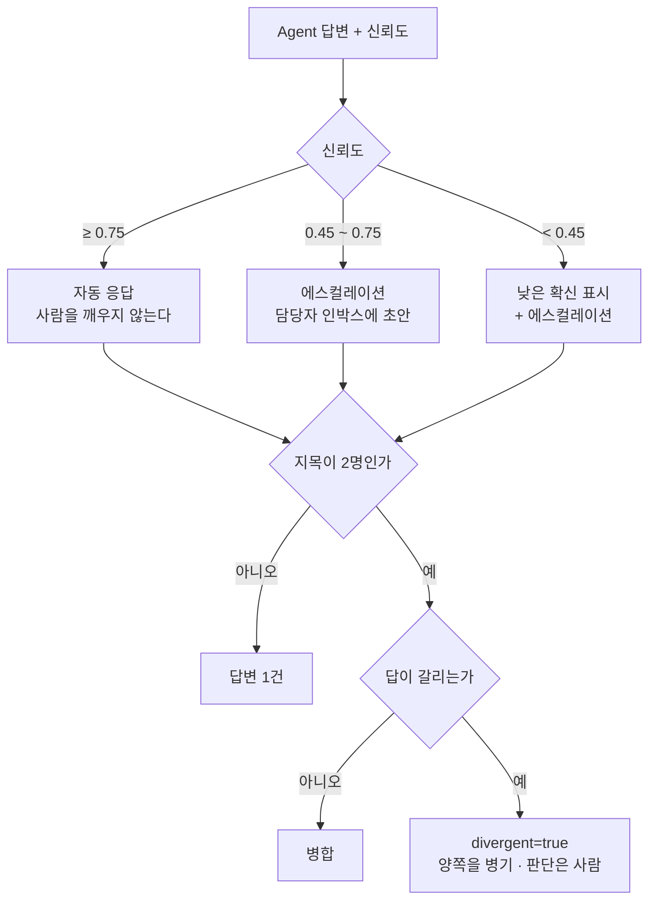

**필드명이 `divergent` 인 것이 설계 결정이다.**

- `conflict: true` = "상충한다" — 단정이고 오탐이 잦다
- `divergent: true` = "서로 다른 답이 나왔다" — 관찰이고 판단은 사람에게 남는다

답변 순서는 요청 순서를 유지한다. 신뢰도로 정렬하면 사용자가 위쪽 답을 정답으로 읽는다.

### 3.7 세션 신선도 — 오래된 지식은 자신 없게 답한다

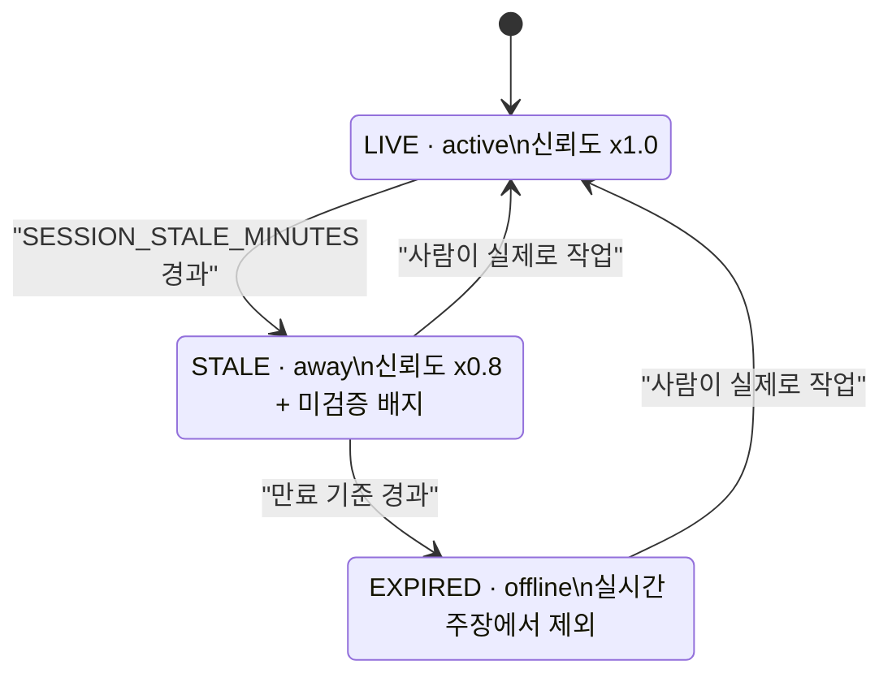

업로드는 이 상태를 되살리지 **않는다** (§3.1).

---

## 4. 코드 구조

### 4.1 레이어 — `ast` 로 강제한다

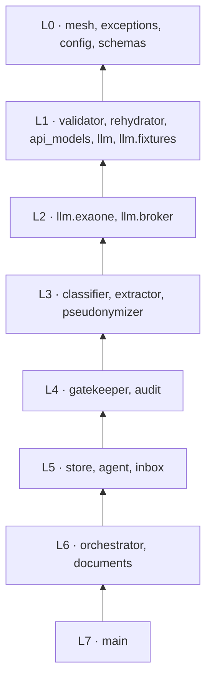

`tests/unit/test_import_boundary.py` 가 소스를 `ast` 로 파싱해 세 규칙을 강제한다.

1. 아래 레이어는 위 레이어를 import 하지 않는다
2. `gatekeeper` 와 `audit` 을 제외한 어떤 모듈도 경계 밖 클라이언트를 import 하지 않는다
3. `open()` 직접 호출 금지 — 파일 접근은 `safe_resolve()` 를 지난다

**리뷰 매너에 의존하지 않는다.** 규칙을 어기면 테스트가 실패한다.

### 4.2 데이터 모델

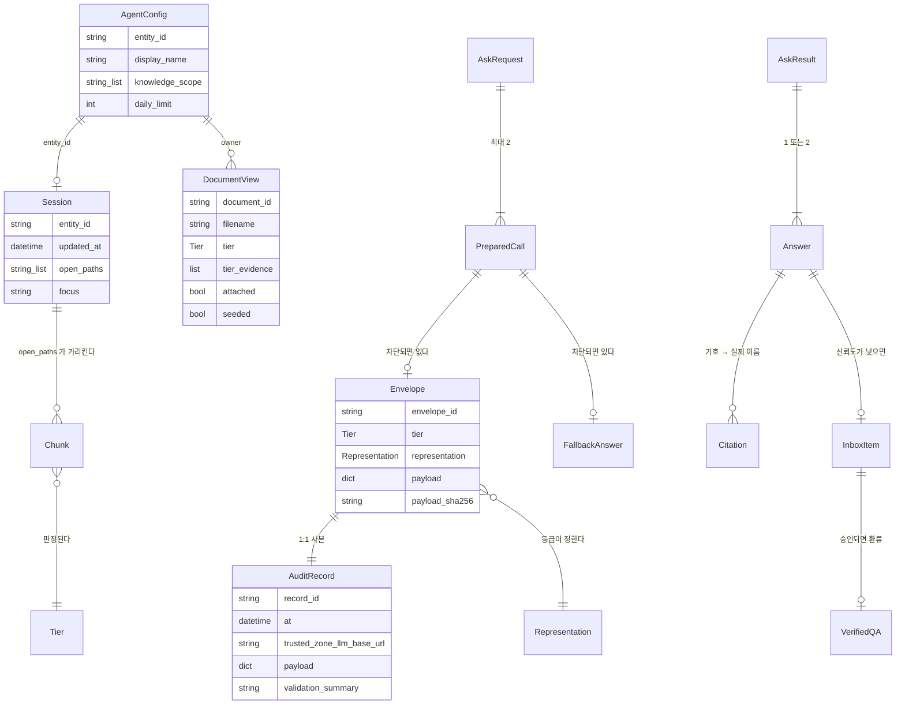

`PreparedCall` 이 `Envelope` 과 `FallbackAnswer` 중 **정확히 하나**를 갖는 것이 중요하다.
차단만 하고 답을 주지 않는 것이 타입 수준에서 불가능하다.

### 4.3 화면

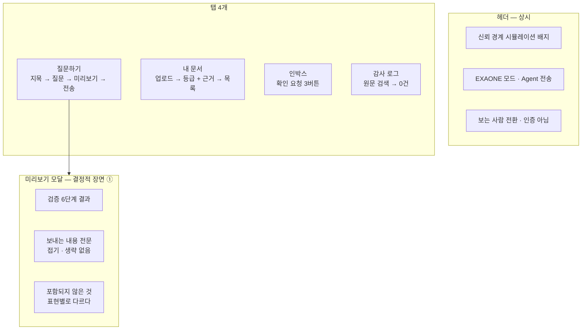

화면은 **빌드 도구가 없다.** `index.html` · `app.js` · `style.css` 세 파일을 FastAPI 가
명시 매핑으로 서빙한다. 디렉터리 매핑을 쓰지 않아 리스팅이 원천 차단된다.

CSP 에 `unsafe-inline` 이 없으므로 인라인 `script`·`style`·이벤트 핸들러가 **동작하지 않는다.**
외부 CDN 참조도 0건이다 — SRI 가 필요 없는 이유이자 오프라인 데모의 전제다.
`scripts/lint_web.py` 가 이 규칙들을 CI 에서 검사한다.

---

## 5. 데스크톱 셸

### 5.1 Tauri 가 하는 일은 세 가지뿐이다

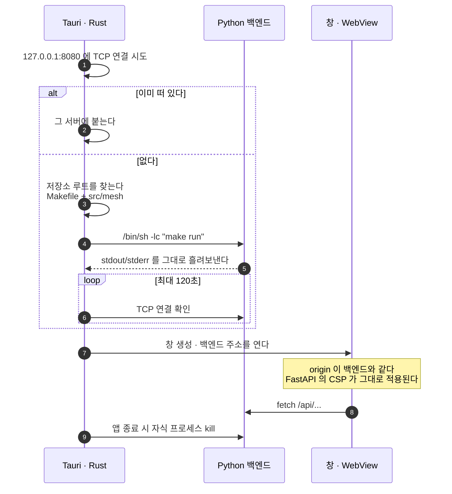

### 5.2 정적 파일을 번들하지 않은 이유

번들하면 origin 이 `tauri://localhost` 가 되고 `fetch("/api/...")` 가 백엔드에 도달하지 못한다.
절대 URL 로 바꾸면 세 가지가 따라온다.

- `connect-src` 를 열어야 한다
- 화면 코드에 호스트가 하드코딩된다
- `lint_web.py` 의 "외부 URL 0건" 규칙이 깨진다

**백엔드 주소를 그대로 열면 같은 origin 이 되어 FastAPI 가 설정한 CSP·보안 헤더가 그대로
적용된다.** 브라우저에서 열 때와 완전히 같은 코드 경로다. 데스크톱 셸이 보안 속성을
바꾸지 않는 것이 핵심이다.

### 5.3 창을 나중에 만드는 이유

`tauri.conf.json` 의 `windows` 가 빈 배열이고 Rust `setup()` 에서 창을 만든다.
백엔드가 준비되기 전에 빈 창을 띄우면 사용자가 "왜 안 되지?" 하게 된다.
120초 안에 포트가 열리지 않으면 창을 만들지 않고 실패를 알린다.

---

## 6. 무엇을 어떻게 검증하는가

### 6.1 게이트

| 게이트 | 기준 | 어떻게 |
|---|---|---|
| SG1 | `.gitignore` 가 자격증명 커버 | `git ls-files` 검사 |
| G1 | `schemas.py` + `vocab.json` 동결 | 계약 테스트 |
| **G2** | **기밀 재현율 100%**, 정확도 ≥90% | `make eval-classify` |
| G3 | 시나리오 종단 통과, 인용 0개 차단 | `make eval` |
| **G4** | **유출 0건** — 자동 + **육안 전수** | `make eval-dump-payloads` |
| G5 | 목업 모드로 전 시나리오 통과 | 네트워크 0회 |
| SG5 | 로그·감사에 원문·토큰 부재 | 감사 로그가 금지 필드를 **거부**한다 |
| SG6 | 의존성 취약점 0건 | `make audit` |
| SG7 | import 경계 3개 규칙 | `ast` 검사 |
| SG8 | `logging` 예약어 충돌 0건 | `ast` 검사 |

### 6.2 왜 G4 는 사람이 해야 하나

자동 검사(`sweep_for_leaks`)는 **아는 것만** 잡는다. 잡지 못하는 것:

- 금칙어 목록에 없는 새 고객사명
- 문장을 옮기지 않고 *의미*를 옮긴 서술
- 슬롯 **이름** 자체가 정보인 경우
- 값 **조합**으로 대상이 특정되는 경우

실제로 이번 육안 확인이 자동 검사가 놓친 결함 2건을 찾았다.

| # | 무엇 | 왜 자동 검사가 놓쳤나 | 고친 방법 |
|---|---|---|---|
| 1 | `person:park` 같은 **entity_id** 가 사내 등급 발췌에 실려 나갔다 | 치환 목록에는 사람 이름(`박선영`)만 있었다. `person:park` 는 목록에 없으므로 "식별자가 아니었다" | `agents.yaml` 에서 entity_id 와 표시 이름을 **유도해** 치환 대상에 자동 추가. 두 파일을 고치게 만들면 하나를 잊고 유출된다 |
| 2 | 사내 등급 미리보기가 "원문 문장·제품명·버전·일정 없음"이라고 **거짓 표시** | 유출이 아니라 **거짓 보증**이다. 검사할 규칙이 없었다 | `excluded_categories` 를 표현별로 나눴다. 가명화는 원문 문장을 유지하는 것이 정의이므로 그것을 약속하지 않는다 |

②가 유출보다 나쁜 이유: 사용자는 그 목록을 읽고 [전송] 을 누른다.
목록이 거짓이면 **"사람이 미리보기를 확인한다"는 방어 겹 자체가 무의미해진다.**

산출물은 [`../aidlc-docs/construction/g4-payload-dump.md`](../aidlc-docs/construction/g4-payload-dump.md) 다.
페이로드 1건 = 섹션 1개, 전문이 절단 없이 들어가고, 각 섹션에 확인 체크박스가 있다.

### 6.3 테스트 구성

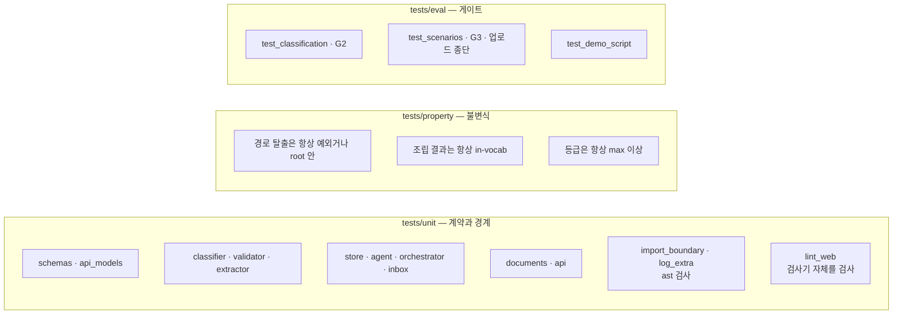

`test_lint_web.py` 가 있는 이유: **검사기를 테스트하지 않으면 검사기가 조용히 아무것도
안 할 수 있다.** 실제로 두 번 그랬다 — 처음엔 주석까지 위반으로 잡았고(오탐 3건),
고친 뒤에는 허용 마커를 주석 제거된 줄에서 찾아 마커가 전혀 동작하지 않았다.
두 경우 모두 "통과"를 출력했고 그 통과는 아무 의미가 없었다.

---

## 7. 남은 것과 알려진 한계

| 항목 | 상태 | 비고 |
|---|---|---|
| 사용자 인증 | **없다** | 드롭다운 전환은 데모용. 화면이 그 사실을 표시한다 |
| 신뢰 구역 LLM | 사외 SaaS | 설정값 하나로 사내 전환. 화면이 상시 표시 |
| 원본 시스템 권한 승계 | 미구현 | **실배포 최우선 요건.** 없으면 권한 우회 도구가 된다 |
| 바이너리 문서 | 받지 않는다 | 기능 미비가 아니라 좁힌 범위. 텍스트로 읽히는 것만 |
| task 스키마 선택 | 결정적 휴리스틱 | 틀리면 유출이 아니라 차단 → 신뢰 구역 내 답변 |
| 전수 유출 검사 | 샘플 데이터라 가능 | 실서비스라면 표본 검사가 된다 |

### 7.1 어휘 사전에 없는 질문은 어떻게 되나

차단된다. 그리고 **신뢰 구역 안에서 답한다.**

처음에는 "어휘 사전의 첫 task" 를 기본값으로 썼다. 근거는 "틀려도 슬롯이 맞지 않아
실패하니 안전하다"였다. **틀렸다.**

실측: `"그때 p99 지연이 얼마였나요?"` 에 힌트가 없어 기본값 `constraint_conflict_check` 가
선택됐고, 그 스키마의 필수 슬롯이 고객사 문서에서 **채워졌다.**
결과: Agent 가 p99 를 묻는 질문에 인증 방식 충돌을 신뢰도 0.75 로 답했다.

유출은 아니지만 **묻지 않은 것에 자신 있게 답하는 것**이 더 나쁘다.
폴백보다 나쁘다 — 사용자가 그 답을 믿는다. 그래서 의도를 모르면 보내지 않는다.

---

## 8. 더 읽을 것

| 문서 | 내용 |
|---|---|
| [`사용설명서.md`](./사용설명서.md) | 설치부터 데모까지 순서대로 |
| [`../aidlc-docs/construction/preflight-findings.md`](../aidlc-docs/construction/preflight-findings.md) | **실측값.** 설계 결정의 근거 |
| [`../aidlc-docs/construction/g4-payload-dump.md`](../aidlc-docs/construction/g4-payload-dump.md) | 경계를 넘은 것 전부 |
| [`../aidlc-docs/construction/u1-gatekeeper-core/functional-design/business-rules.md`](../aidlc-docs/construction/u1-gatekeeper-core/functional-design/business-rules.md) | 보안 규칙 전부 |
| [`../aidlc-docs/inception/requirements/requirements.md`](../aidlc-docs/inception/requirements/requirements.md) | FR 55개 + NFR 34개 |
| [`../requirements/hackathon-mvp-design.md`](../requirements/hackathon-mvp-design.md) | 원래 설계 문서 |
