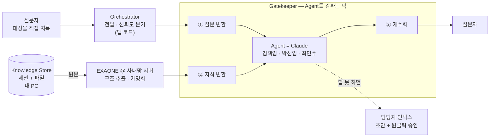
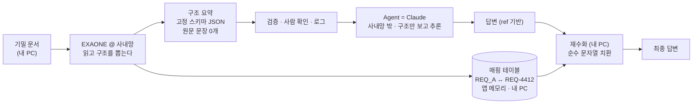
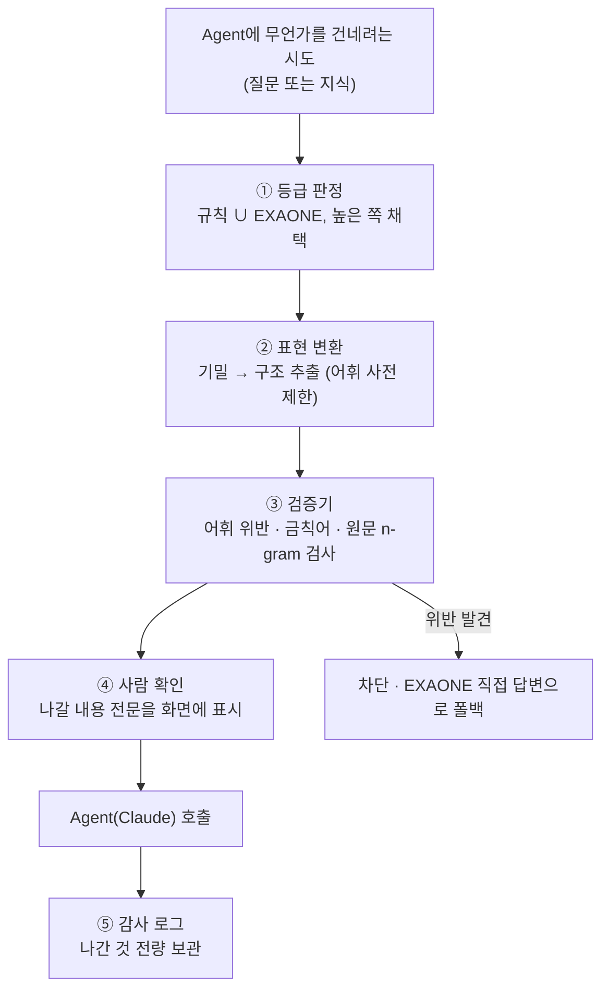
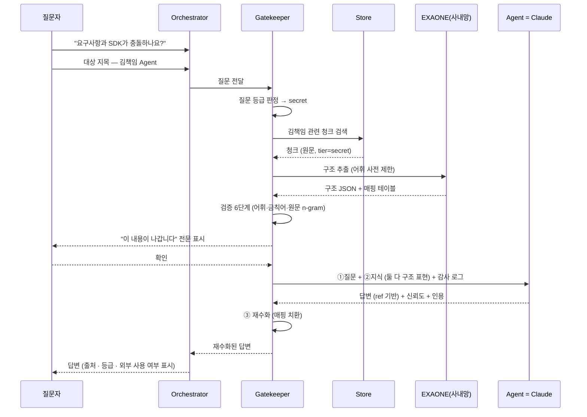

# 대리 에이전트 메시 — 해커톤 MVP 설계서

> **한 줄 요약**: 지식을 가진 사람 앞에 대리 에이전트를 세우고, 질문을 사람이 아니라 에이전트에게 보낸다. 기밀 자료는 사내망 안에서만 읽히고, 외부 AI에는 **데이터가 아니라 문제의 구조만** 나간다.

---

## 목차

1. [만들려는 것](#1-만들려는-것)
2. [해커톤 전제](#2-해커톤-전제)
3. [보안 모델 — 이 문서의 중심](#3-보안-모델--이-문서의-중심)
4. [컴포넌트 설계](#4-컴포넌트-설계)
5. [샘플 데이터 설계](#5-샘플-데이터-설계)
6. [기술 스택](#6-기술-스택)
7. [구현 계획 (5일)](#7-구현-계획-5일)
8. [데모 시나리오](#8-데모-시나리오)
9. [평가 방법](#9-평가-방법)
10. [한계와 향후](#10-한계와-향후)

---

## 1. 만들려는 것

### 1.1 풀려는 문제 세 가지

| # | 문제 | 지금 벌어지는 일 |
|---|---|---|
| **P1** | 물어볼 사람을 찾고, 묻고, 기다린다 | 질문자는 대기하고 답변자는 하던 일이 끊긴다 |
| **P2** | 기밀 자료는 외부 AI에 못 넣는다 | AI가 가장 도움이 될 자료가 정확히 못 넣는 자료다 |

### 1.2 하나의 구조로 세 문제를 푼다

```
질문자가 대상을 고른다  →  [ 그 사람의 Agent ]  →  답변
                                    │
                                    └── 답 못 하면 초안과 함께 사람에게
```

**핵심 발상은 사람 앞에 대리인을 세우는 것이다.** 질문은 사람이 아니라 그의 에이전트로 간다. 에이전트가 답할 수 있으면 사람은 이 대화를 알지도 못하고, 답할 수 없을 때만 — 그것도 요약과 초안이 붙은 상태로 — 사람에게 도달한다.

- **P1** → 아는 사람에게 묻되 **그 사람을 깨우지 않는다.** 에이전트가 먼저 답하고, 못 하면 초안까지 만들어 넘긴다
- **P2** → Agent가 보는 모든 것이 게이트키퍼 한 곳을 통과한다 (§3)

### 1.3 전체 그림



**Agent는 Claude다.** 대리인의 두뇌는 외부 모델이고, 추론을 담당한다.
**원문은 사내망을 벗어나지 않는다.** Agent가 지식을 담고 있는 게 아니라 꺼내 쓰는 쪽이고, 그 길목을 Gatekeeper가 막고 있기 때문이다. EXAONE은 사내망 서버에서 돌며 원문을 읽을 수 있는 유일한 모델로서, Agent가 볼 수 있는 표현으로 번역해 준다.

컴포넌트는 **네 개**다: Orchestrator, Agent, Gatekeeper, Knowledge Store. 자세한 것은 §4.2~4.4.

---

## 2. 해커톤 전제

| 항목 | 전제 |
|---|---|
| **실행 환경** | **개인 노트북 1대 + 사내망 접속.** 앱·세션·샘플 파일은 노트북에, EXAONE은 사내망 서버에 있다 |
| **EXAONE** | **사내망 서버**에서 서빙 중인 것을 API로 호출. 노트북에 모델을 설치하지 않는다 |
| **데이터** | **전부 우리가 직접 만든 샘플.** 실제 사내 문서·고객 자료 일절 미사용 |
| **규모** | 에이전트 3개, 문서 40~60건, 청크 200~400개 |
| **인원·기간** | 2~3명, 5일 |

### 2.1 샘플 데이터라서 가능해지는 것

실제 데이터가 없다는 게 제약처럼 보이지만, 이 프로젝트에서는 오히려 **검증을 가능하게 만드는 조건**이다.

| 이점 | 설명 |
|---|---|
| **정답 라벨이 있다** | 문서를 우리가 만들었으니 각 문서의 보안 등급 정답을 안다 → 분류 정확도를 **정확히 측정**할 수 있다 |
| **유출을 전수 검사할 수 있다** | 외부로 나간 페이로드가 수십 건 규모라 **전량을 눈으로 확인**할 수 있다. "유출 0건"이 주장이 아니라 검증 결과가 된다 |
| **함정을 심을 수 있다** | 겉보기엔 평범하지만 실제로는 기밀인 문서를 일부러 넣어 분류기가 잡는지 시연할 수 있다 |
| **데모가 재현된다** | 질문과 정답을 고정할 수 있어 시연이 흔들리지 않는다 |

**작은 규모가 곧 증명 가능성이다.** 이 점을 설계 전반에서 활용한다.

---

## 3. 보안 모델 — 이 문서의 중심

> **질문**: 외부 AI가 기밀 자료를 확인해도 괜찮게 만들려면 어떻게 모델링해야 하는가?

### 3.1 먼저, 마스킹은 답이 아니다

가장 먼저 떠오르는 방법은 "민감한 부분을 지우고 나머지를 보낸다"이다. 이건 세 가지 이유로 무너진다.

**(1) 알맹이 자체가 기밀이다.**
"고객사 H의 인증 요구사항이 우리 SDK와 충돌하는가"에서 회사명 `H`는 쉽게 지운다. 그런데 정작 기밀인 건 *인증 요구사항의 내용*이다. 그걸 지우면 질문이 남지 않는다.

```
원문   : "H社는 세션 바인딩된 EAP-AKA 인증을 요구하며 자격증명 재사용을 금지한다"
마스킹 : "████는 ████ 인증을 요구하며 ████를 금지한다"
        → 외부 AI가 답할 수 있는 게 아무것도 없다
```

**(2) 지우고 남은 것으로 재식별된다.**
회사명만 지워도 "북미 통신사 · 5G 코어망 · 2026년 상용화"가 남으면 사실상 실명이다. 조각 각각은 안전해 보여도 합치면 특정된다.

**(3) 놓친 것을 아무도 모른다.**
마스킹은 *지울 것을 찾는* 작업이다. 즉 **찾지 못한 것은 그대로 나간다.** 실패가 조용히 일어나고, 사고는 한참 뒤에 발견된다.

> **(3)이 결정적이다.** "무엇을 지울까"를 정하는 방식은 실수 한 번이 곧 유출이다. 안전한 설계는 반대여야 한다 — **"무엇만 내보낼까"를 정한다.** 그러면 실수해도 유출이 일어날 경로 자체가 없다.

### 3.2 핵심 원칙: 데이터는 사내망 안에, 추론은 밖에

```
                       데이터를 본다      추론을 잘한다
EXAONE  (사내망 안)         ✅                △
Claude  (사내망 밖)         ❌                ✅
```

**신뢰 경계는 노트북이 아니라 사내망이다.** 내 PC와 사내 EXAONE 서버는 같은 구역 안에 있고, 그 사이의 통신은 사내망 내부 이동이다. 경계를 넘는 것은 Claude 호출 하나뿐이며, Gatekeeper가 정확히 그 경계에 서 있다.

두 모델의 강점이 정확히 상보적이다. 그래서 역할을 나눈다.

> **외부 AI는 지식 소스가 아니라 추론 엔진이다.**
> 외부로 나가는 것은 *자료*가 아니라 *문제의 형태*다.
> 자료는 사내망 안에서만 읽히고, 밖에서 돌려준 답변을 사내망 안에서 실제 이름으로 되돌린다.



Claude는 이 흐름 어디에서도 원문 문장을 보지 않는다. 그런데도 가장 어려운 부분 — 추론과 답변 구성 — 을 담당한다. 답을 짜는 것은 Agent(Claude)이고, 사내망 안에서 하는 마지막 일은 참조 기호를 실제 이름으로 되돌리는 문자열 치환뿐이다.

**매핑 테이블은 EXAONE 서버에 남기지 않는다.** 앱(내 PC)이 들고 있다가 응답 후 폐기한다. 서버는 변환만 하고 상태를 갖지 않는다.

### 3.3 보안 등급과 외부 표현

등급은 **"외부 AI를 쓸 수 있나 없나"** 를 정하지 않는다. **"어떤 표현으로 나가나"** 를 정한다. 모든 등급이 외부 추론의 도움을 받을 수 있다.

| 등급 | 예시 | 외부로 나가는 표현 | 원문 문장 포함 |
|---|---|---|---|
| **공개 (Open)** | 오픈소스 문서, 공개 스펙 | 원문 그대로 | ○ |
| **사내 (Internal)** | 내부 설계 문서, 코드 구조 | 고유명사를 placeholder로 치환한 원문 | △ (식별자 제거) |
| **기밀 (Secret)** | 고객사 요구사항명세서, 계약 정보 | **구조 요약 JSON만** | **✕ (0개)** |

판정이 애매하면 **항상 더 높은 등급으로 올린다.** 등급을 낮게 잡은 실수는 유출이고, 높게 잡은 실수는 불편일 뿐이다. 비대칭이 명확하다.

### 3.4 구조 추출 — 기밀 등급의 처리 방식

기밀 문서에 대해 EXAONE이 하는 일은 요약이 아니라 **고정된 스키마의 빈칸 채우기**다.

#### 예시: 요구사항 충돌 검토

**원문 (기밀 · 사내망 안에만 존재)**
> "H社 5G 코어망 요구사항 REQ-4412: 인증은 세션에 바인딩된 EAP-AKA 방식이어야 하며, 자격증명 재사용은 금지한다. 세션 최대 유지시간은 8시간이다."
> "우리 SDK v3.2는 토큰 수명 24시간, 백그라운드 무음 갱신, 세션 바인딩 없음."

**외부로 나가는 것 (전부)**
```json
{
  "task": "constraint_conflict_check",
  "domain": "authentication",
  "entities": [
    {
      "ref": "REQ_A",
      "role": "external_requirement",
      "facts": {
        "auth_mechanism_class": "challenge_response",
        "session_binding": "required",
        "credential_reuse_allowed": false,
        "max_session_hours": 8
      }
    },
    {
      "ref": "COMP_B",
      "role": "our_component",
      "facts": {
        "credential_lifetime_hours": 24,
        "renewal_mode": "background_silent",
        "session_binding": "none"
      }
    }
  ],
  "question_template": "conflict_and_mitigation",
  "answer_format": {
    "conflict": "bool",
    "reason": "string",
    "mitigations": "string[]"
  }
}
```

**여기에 없는 것**: 고객사명, 제품명, 버전, 요구사항 번호, 원문 문장, 담당자, 일정, 금액. 하나도 없다.
**그런데도 충분하다**: 외부 모델은 "8시간 세션에 바인딩된 인증"과 "24시간 무음 갱신 토큰"이 충돌하는지, 어떤 완화가 가능한지 제대로 추론할 수 있다.

#### 왜 이 방식이 구조적으로 안전한가

핵심은 **EXAONE이 자유 텍스트를 생성하지 않는다**는 점이다.

| 일반적인 요약 방식 | 구조 추출 방식 |
|---|---|
| "이 문서를 요약해줘" → 자유 문장 생성 | "이 필드에 해당하는 값을 **어휘 사전에서 고르라**" → 열거값 선택 |
| 원문 표현이 요약에 섞여 나올 수 있다 | 사전에 없는 값은 애초에 출력될 수 없다 |
| 무엇이 나갈지 사전에 알 수 없다 | 나갈 수 있는 값의 전체 집합이 사전에 확정돼 있다 |

**필드 어휘 사전 (`vocab.json`)** 이 이 설계의 심장이다.

```json
{
  "auth_mechanism_class": ["password", "challenge_response", "certificate", "biometric", "token_bearer"],
  "session_binding": ["required", "optional", "none"],
  "renewal_mode": ["explicit", "background_silent", "none"],
  "credential_lifetime_hours": { "type": "number", "range": [0, 8760] },
  "role": ["external_requirement", "our_component", "constraint", "goal"]
}
```

EXAONE의 작업은 생성이 아니라 **분류**다. 그래서 원문 문구가 새어나갈 채널이 존재하지 않는다.

- 문자열 필드는 전부 열거형 → 사전에 없는 값이 나오면 **검증 실패로 전송 차단**
- 숫자 필드는 범위 검사
- `question_template`은 미리 정의된 질문 틀의 ID일 뿐, 자유 문장이 아니다
- `ref` 값(`REQ_A`, `COMP_B`)은 자동 생성된 번호로, 실제 이름과 무관하다

### 3.5 4중 방어

한 겹이 뚫려도 다음 겹이 막도록 쌓는다.



| 방어 | 무엇을 막는가 | 실패해도 괜찮은 이유 |
|---|---|---|
| **① 등급 판정** | 기밀을 공개로 오판 | 애매하면 상향. ②가 이어받는다 |
| **② 표현 변환** | 원문 유출 | 어휘 사전 밖의 값은 생성 자체가 안 된다 |
| **③ 검증기** | ②의 버그 | 기계적 검사. 고객사명 사전·계약번호 정규식·원문 n-gram 대조 |
| **④ 사람 확인** | ①~③ 전부의 실패 | **나갈 내용이 JSON 수십 줄이라 사람이 실제로 읽을 수 있다** |
| **⑤ 감사 로그** | 사후 발견 | 무엇이 나갔는지 100% 재구성 가능 |

**④가 성립하는 이유가 중요하다.** 자유 텍스트 요약을 보낸다면 사람이 매번 읽고 판단하는 건 비현실적이다. 하지만 구조 추출 결과는 필드가 10~20개인 JSON이라 3초면 훑을 수 있다. **표현을 작게 만든 것이 곧 사람 검토를 가능하게 만들었다.**

#### 검증기 상세 (`gatekeeper.validate`)

```
1. 스키마 검증      : 모든 필드가 정의된 키인가
2. 어휘 검증        : 모든 문자열 값이 vocab.json에 있는가
3. 범위 검증        : 모든 숫자가 허용 범위인가
4. 금칙어 검사      : 고객사명 사전 / 계약번호·제품코드 정규식에 걸리는가
5. 원문 대조        : 원본 문서의 5-gram 중 하나라도 페이로드에 등장하는가
6. 크기 제한        : 페이로드가 2KB를 넘는가 (넘으면 자유 텍스트가 섞였다는 신호)
→ 하나라도 실패하면 전송 차단, 사내망 내부 처리로 폴백
```

5번(원문 n-gram 대조)이 특히 강력하다. **원문 문장이 한 조각이라도 페이로드에 있으면 기계적으로 잡힌다.**

### 3.6 재수화 — 답변을 되돌리기

Agent 응답은 `REQ_A`, `COMP_B` 같은 참조로 말한다. 사내망 안에서 실제 대상으로 되돌려 사용자에게 보여준다.

```
외부 응답 : "REQ_A는 세션 바인딩을 요구하나 COMP_B는 세션과 무관하게 자격증명을
             갱신하므로 충돌한다. 완화안: (1) 세션 종료 시 토큰 무효화 …"
                          ↓ 매핑 적용 (매핑 테이블은 앱 메모리에만)
사용자 화면: "고객사 요구사항 REQ-4412는 세션 바인딩을 요구하나 SDK v3.2는 세션과
             무관하게 토큰을 갱신하므로 충돌합니다. 완화안: (1) 세션 종료 시 토큰
             무효화 …"
```

사용자는 자연스러운 답을 받는다. 그 답이 만들어지는 과정에서 외부 모델은 `REQ-4412`도 `SDK v3.2`도 본 적이 없다.

### 3.7 사내 등급의 처리 — 가역적 가명화

기밀보다 한 단계 낮은 사내 등급은 원문의 논리를 살린 채 식별자만 치환한다.

```
원문    : "Nova 게이트웨이는 레거시 SSO의 커스텀 클레임 매핑을 지원하지 못했다"
가명화  : "<SYS_1>은 <SYS_2>의 커스텀 클레임 매핑을 지원하지 못했다"
             ↓ 외부 LLM
응답    : "<SYS_1>이 <SYS_2>의 매핑을 지원하려면 어댑터 계층이 …"
             ↓ 재수화 (내 PC)
사용자  : "Nova 게이트웨이가 레거시 SSO의 매핑을 지원하려면 어댑터 계층이 …"
```

- placeholder는 한 질의 안에서 **일관**되어야 한다 (같은 대상 = 같은 번호). 그래야 외부 모델이 관계를 추론한다
- 매핑 테이블은 앱(내 PC) 메모리에만 있고 응답 후 폐기한다. EXAONE 서버에도 남기지 않는다
- **기술 용어(`클레임 매핑`, `SSO`)는 치환하지 않는다.** 치환하면 답변 품질이 무너진다

> 바로 이 점이 사내 등급과 기밀 등급을 가르는 기준이다. 사내 문서는 기술 용어가 남아도 괜찮지만, **기밀 문서는 기술 내용 자체가 비밀**이라 가명화로는 부족하다. 그래서 기밀은 §3.4의 구조 추출로 간다.

### 3.8 한계 — 정직하게

이 모델은 위험을 **크게 줄이지만 없애지는 못한다.** 팀이 공유해야 할 경계선:

| 남는 위험 | 설명 | 완화 |
|---|---|---|
| **속성 조합에 의한 추론** | `domain: authentication` + `max_session_hours: 8` + 특정 enum 조합이 업계에서 특정 고객사를 시사할 수 있다 | 필드 수 상한, `domain`을 상위어로만 표기, 사람 확인(④) |
| **질문 자체가 정보** | "이 조합이 충돌하는가"를 묻는다는 사실 자체가 무언가를 알려준다 | 이 정도 잔여 위험은 수용한다고 **명시적으로** 결정한다 |
| **등급 판정 실패** | 기밀 문서를 사내로 오판하면 가명화 원문이 나간다 | 규칙 기반을 병행(문서 경로·헤더·고객사 사전), 애매하면 상향, ⑤ 로그로 사후 발견 |
| **EXAONE의 추출 오류** | 사실을 잘못 뽑으면 답변이 틀린다 | 유출 문제는 아니지만 품질 문제. 인용 표시로 사용자가 검증 |

> **팀에 못 박을 규칙**: "구조 추출을 거쳤으니 무엇이든 보내도 된다"는 논리는 금지한다. 구조 추출은 *어휘 사전이 통제하는 범위 안에서만* 안전하다. 새로운 task 유형을 추가할 때는 반드시 어휘 사전과 검증 규칙을 함께 정의한다.

---

## 4. 컴포넌트 설계

네 개의 컴포넌트, 각각 파일 하나. 이해하기 쉬운 크기를 유지하는 것이 설계 목표다.

### 4.1 한눈에

| 컴포넌트 | 한 줄 역할 | 입력 | 출력 | 파일 |
|---|---|---|---|---|
| **Orchestrator** | 지목된 에이전트에게 질문을 넘기고, 답을 신뢰도로 분기한다 | 질문 + 지목 대상 | 최종 답변 또는 에스컬레이션 | `orchestrator.py` |
| **Agent** | **Claude.** 한 주체를 대리해 답한다. 못 하면 초안을 만들어 넘긴다 | 질문 + 허용된 지식 표현 | 답변 + 신뢰도 + 인용 | `agent.py` |
| **Gatekeeper** | Agent를 감싸는 막. Agent가 무엇을 볼 수 있는지 통제한다 | 질문 / 지식 / 답변 | 등급에 맞게 변환된 것 | `gatekeeper.py` |
| **Knowledge Store** | 세션을 유지하고, 지목된 경로의 파일을 읽는다 | 세션 조회 / 파일 경로 | 세션 상태 + 파일 내용 | `store.py` |

**Agent 구현은 하나다.** 사람 대리와 프로젝트 대리는 같은 Claude 호출에 설정(페르소나 프롬프트, 지식 범위, 에스컬레이션 대상 유무, 시점 고지 여부)만 다르게 준다. 클래스를 나누지 않는다.

### 4.2 Agent는 Claude다

**대리인의 두뇌는 사외 모델이다.** 질문을 이해하고, 무엇을 찾아야 할지 정하고, 찾은 것으로 답을 구성하는 일 — 이 추론을 Claude가 한다. 사내 EXAONE으로는 이 수준이 안 나온다.

여기서 자연스러운 반문이 나온다. *"그러면 기밀 자료가 Claude에게 가는 것 아닌가?"*

**아니다. 에이전트는 지식을 담고 있는 게 아니라 꺼내 쓰는 쪽이기 때문이다.** 김책임 Agent가 김책임의 지식을 "가지고" 있는 게 아니다. 필요할 때 Knowledge Store에서 꺼내 온다. 그 **꺼내 오는 길목에 Gatekeeper가 있으면**, Agent가 사외 모델이어도 원문은 사내망을 벗어나지 않는다.

```
╔══════════════ 사내망 (신뢰 구역) ══════════════╗
║                                                ║      사내망 밖
║  질문자 ──→ ① 질문 변환 ────────────────────── ╫──→  ┌──────────┐
║                                                ║     │  Agent   │
║  Store ──원문──→ EXAONE ──→ ② 지식 변환 ────── ╫──→  │ = Claude │
║  (내 PC)         (사내 서버)                    ║     └────┬─────┘
║                                                ║          │
║  질문자 ←── ③ 재수화 ───────────────────────── ╫──────────┘
║             (내 PC · 매핑 테이블)               ║
╚════════════════════════════════════════════════╝
                        ↑
              Gatekeeper가 이 경계에 선다
```

**Gatekeeper는 사내망 경계에 서서 Agent를 감싸는 막이다.** Agent로 들어가는 것(질문·지식)과 나오는 것(답변)이 모두 이 막을 통과한다. 관문이 셋인 이유는 Agent가 정보를 얻을 수 있는 경로가 셋이기 때문이다.

| 관문 | 무엇을 통제하나 | 기밀일 때의 동작 |
|---|---|---|
| **① 질문 변환** | 사용자 질문 자체 | 질문에 고객사명·요구사항 번호가 섞여 있으면 구조화해서 넘긴다 |
| **② 지식 변환** | Store 검색 결과 | 원문 청크 대신 **구조 요약 JSON**을 넘긴다 (§3.4) |
| **③ 재수화** | Agent의 답변 | `REQ_A` → `REQ-4412`로 되돌려 사용자에게 보낸다 (§3.6) |

①을 빠뜨리면 안 된다. 지식을 아무리 잘 막아도 **질문 문장 자체가 기밀을 담고 있으면** 그대로 새어 나간다.

### 4.3 그럼 EXAONE은 무엇을 하나

**사내 지식 어댑터다.** 원문을 읽을 수 있는 유일한 모델이고, 그것을 Agent가 볼 수 있는 표현으로 번역한다. 사내망 서버에서 돌므로 원문이 그 경계를 넘지 않는다.

| | Agent (Claude) | EXAONE |
|---|---|---|
| 위치 | **사내망 밖** | **사내망 안** (사내 서버) |
| 원문 접근 | **불가** | 가능 |
| 하는 일 | 추론 · 답변 구성 · 신뢰도 판단 | 등급 판정 보조 · 구조 추출 · 가명화 |
| 성격 | 두뇌 | 번역기 |

등급에 따라 Agent가 받는 표현이 달라진다.

| 지식 등급 | EXAONE이 만드는 표현 | Agent(Claude)가 보는 것 |
|---|---|---|
| **기밀 Secret** | 구조 요약 JSON (어휘 사전 제한) | **원문 문장 0개** |
| 사내 Internal | 고유명사 → placeholder 치환 | 가명화된 원문 |
| 공개 Open | 변환 없음 | 원문 |

**차단 결정은 EXAONE이 아니라 코드가 한다.** EXAONE은 변환안을 제안하고, Gatekeeper의 검증 6단계(§3.5)가 통과 여부를 정한다. 안전성이 모델의 판단에만 의존하면 프롬프트 인젝션과 환각에 그대로 노출되기 때문이다. 어휘 사전 검증과 원문 n-gram 대조는 모델이 무엇을 하든 기계적으로 걸러낸다.

**Orchestrator는 Claude가 아니다.** 지목된 에이전트에게 질문을 넘기고 신뢰도로 분기하는 앱 코드일 뿐이며, 모델을 부르지 않는다 (§4.4).

### 4.4 Orchestrator — 지목은 사람이 한다

```
책임   : 지목된 에이전트에게 질문 전달 → 답변 수집 → 신뢰도로 분기 → 에스컬레이션
입력   : { question, asker, target_entity_ids[] }
출력   : { answer, citations, confidence, escalated }
```

#### 4.4.1 시스템은 누구에게 물을지 정하지 않는다

**질문자가 직접 고른다.** 전문성 매칭도, 브로드캐스트도 없다.

현업에서 사람들은 대체로 누가 무엇을 아는지 안다. "인증은 김책임, 데이터 파이프라인은 박선임" 정도는 이미 머릿속에 있다. 시스템이 풀어야 할 문제는 **누구인지 찾아주는 것이 아니라, 그 사람을 방해하지 않고 답을 얻게 하는 것**이다.

> **P1의 정의**
> ❌ "누구에게 물어야 할지 모르겠다"
> ✅ **"아는 사람을 알지만, 물어보면 그 사람의 일이 끊긴다"**

이 결정으로 사라지는 것:

| 사라지는 것 | 이유 |
|---|---|
| 전문성 매칭 · 임베딩 | 지목을 사람이 하므로 불필요 |
| 라우팅 프로필 | 중앙이 남의 작업 상태를 알 필요가 없어짐 |
| 브로드캐스트 판정기 | 질문이 전원에게 퍼지지 않음 |

**부작용까지 함께 사라진다.** 오라우팅도 없고, 기밀 질문이 전사에 뿌려질 일도 없고, 프로필 노후·콜드스타트 문제도 없다. 사람이 고르는 것이 이 규모에서는 가장 정확하고 가장 안전하다.

#### 4.4.2 대신 고르기 쉽게 만든다

질문 화면에 에이전트 목록을 띄운다. 세션에서 파생된 정보는 이제 라우팅이 아니라 **선택을 돕는 데** 쓰인다.

```
누구에게 물어보시겠어요?

 ● 김철수 책임의 Agent          인증 · SSO · SDK 보안
   🟢 활동 중 · 오늘 질문 3건    지금 인증 관련 작업 중

 ○ 박선영 선임의 Agent          데이터 파이프라인 · 모델 학습
   🟢 활동 중 · 오늘 질문 1건    지금 학습 실행 중

 ○ 최민수 선임의 Agent          SDK 인증 모듈 · 배포 파이프라인
   ⚪ 자리 비움 (2시간)         오늘 질문 0건

                              [ 2명까지 선택 가능 ]
```

| 표시 항목 | 출처 | 공개 범위 |
|---|---|---|
| 담당 영역 | **본인이 직접 작성** (자기소개) | 항상 공개 |
| 활동 상태 · 오늘 질문 수 | 세션 파생 | 본인이 표시 여부를 켠다 |
| "지금 ○○ 작업 중" | 세션 파생 (식별자 제거) | 본인이 표시 여부를 켠다 |

세션 원문은 여전히 어디에도 나가지 않는다. 사용자가 보는 것은 본인이 공개하기로 한 한 줄뿐이고, **시스템이 몰래 고르는 것보다 정직하다.**

#### 4.4.3 잘못 물었을 때

사람도 틀린다. 다만 이 경우 시스템이 자동으로 재지목하지 않고 **사람에게 되돌린다.**

```
담당자 인박스 → [ 내가 아님 ] → "박선임에게 물어보세요" 지목
             → 질문자 화면: "김책임이 박선임을 지목했습니다  [ 박선임에게 다시 묻기 ]"
```

현실에서 벌어지는 일과 같다. 그리고 **사람이 지목했으므로 정확하다** — 알고리즘 추정보다 낫다.

#### 4.4.4 두 명을 고르면

질문자가 두 에이전트를 고르면 병렬 호출하고 답을 병기한다. 상충하면 **하나를 조용히 고르지 않고** `conflict: true`로 양쪽을 출처·시점과 함께 보여준다. 조직 지식의 불일치는 그 자체로 발견할 가치가 있다.

상한은 2개다. 그 이상은 답변이 길어지고 비용만 늘어난다.

#### 4.4.5 답을 못 하면

에이전트가 답하지 못한 질문은 **지식 공백**으로 기록된다. 지목이 사람 손에 있으므로 "아무도 모른다"는 판정은 못 하지만, *"이 사람에게 물었는데 답이 없었다"* 는 기록만으로도 문서화 우선순위의 재료가 된다.

#### 4.4.6 신뢰도 분기

| 조건 | 동작 |
|---|---|
| 신뢰도 ≥ 0.75 **그리고** 인용 1개 이상 | 자동 응답 |
| 0.45 ~ 0.75 | 답변하되 **`미검증`** 배지 + 담당자 인박스에 확인 요청 |
| < 0.45 | 에스컬레이션 (초안 첨부) |
| **인용 0개** | 신뢰도와 무관하게 **에스컬레이션** |

마지막 규칙이 가장 중요하다. **근거 없는 생성은 사용자에게 도달하지 않는다.**

#### 4.4.7 한계 설정

에이전트 호출은 최대 2개, 전체 30초, 에이전트 간 직접 호출 없음. 모든 조율은 Orchestrator를 거친다. (에이전트끼리 자유롭게 대화하게 두면 순환과 토큰 폭발로 디버깅이 불가능해진다.)

### 4.5 Agent

```
정체   : Claude (claude-sonnet-5)
책임   : 자기 지식 범위에서 답변 생성 + 신뢰도 산정 + 인용 수집
입력   : { question(변환됨), entity_id, knowledge(변환됨) }
출력   : { answer, confidence, citations[], escalation_draft }
```

**동작**
1. Gatekeeper ①이 질문을 등급에 맞게 변환해 Agent에 전달
2. Agent가 필요한 지식을 요청 → Store 검색 → EXAONE 변환 → Gatekeeper ②가 등급에 맞는 표현으로 전달
3. Agent가 답변 생성 + 인용 첨부 + 신뢰도 산정
4. 신뢰도가 낮으면 **에스컬레이션 초안**을 만든다: 질문 요약 + 지금까지 찾은 근거 + 답변 초안
5. Gatekeeper ③이 재수화해서 사용자에게 전달

**Agent 프롬프트에 못 박을 것**: 받은 표현이 구조 요약 JSON일 때, Agent는 그것을 원문으로 착각하지 않아야 한다. *"당신이 받은 것은 실제 문서가 아니라 구조 요약입니다. 답변은 참조 기호(`REQ_A` 등)로 하십시오"* 를 시스템 프롬프트에 명시한다. 그래야 ③ 재수화가 성립한다.

**사람마다 다른 것은 설정뿐이다**

| 설정 | 내용 |
|---|---|
| 페르소나 프롬프트 | "김철수 책임의 Agent" |
| 지식 범위 | 그 사람의 세션 + 세션이 가리키는 경로 |
| 에스컬레이션 대상 | 그 사람의 인박스, SLA, 일일 상한 |

에이전트를 추가하는 일은 **설정 한 줄을 더하는 것**이다. 코드를 건드리지 않는다.

**1인칭으로 사람인 척하지 않는다.** 모든 답변에 "○○의 Agent" 라벨이 붙는다. 사람인 줄 알았다가 아니었다는 경험은 신뢰를 단번에 무너뜨린다.

**에스컬레이션 초안이 P1 해결의 나머지 절반이다.** 담당자에게 질문 원문만 던지면 알림이 하나 늘 뿐이다. 요약·근거·초안이 함께 가야 담당자의 처리 비용이 몇 분에서 몇 초로 떨어진다.

### 4.6 Gatekeeper

§3의 구현체. **Agent(Claude)를 부르는 것도, Agent에게 무언가를 건네는 것도 전부 이 파일을 거친다.** 다른 파일에서 Claude 클라이언트를 import하지 않는 것을 코드 규칙으로 정한다.

```python
# 인터페이스
def classify(text, source_path) -> Tier               # 등급 판정
def to_payload(text, tier, task) -> Payload           # 표현 변환 (관문 ①②)
def validate(payload, original_text) -> Result        # 검증 6단계
def preview(payload) -> str                           # 사람 확인용 전문
def ask_agent(payload, persona) -> Response           # Agent(Claude) 호출 + 감사 로그
def rehydrate(response, mapping) -> str               # 재수화 (관문 ③)
```

`ask_agent`가 유일한 외부 호출 지점이다. 질문이든 지식이든 이 함수의 인자로만 Agent에 도달하고, 인자는 반드시 `validate`를 통과한 것이어야 한다.

**등급 판정**은 규칙과 EXAONE 판정 중 **높은 쪽**을 채택한다.

```python
tier = max(rule_tier(text, source_path), exaone_tier(text))
```

- 규칙: 문서 경로(`corpus/customer/**` → 기밀), 헤더의 등급 표기, 고객사명 사전, 계약번호 정규식
- EXAONE: 규칙이 못 잡는 문맥적 기밀성
- 둘 중 하나만 기밀이라고 해도 기밀로 처리한다

**실패 시 동작**: 분류 오류·타임아웃·검증 실패는 전부 **기밀로 간주하고 사내망 내부 처리**로 돌린다. 어떤 경우에도 "잘 모르겠으니 일단 보낸다"가 되지 않는다.

### 4.7 Knowledge Store

```
책임   : 세션 유지 + 지목된 경로의 파일 읽기
입력   : { query, entity_id }
출력   : Chunk[]
```

**청크 구조** (필요한 최소한만)

```json
{
  "chunk_id": "ck_012",
  "entity_id": "person:kim",
  "text": "…",
  "tier": "secret",
  "source": "corpus/customer/req-spec.md",
  "as_of": "2023-11-14",
  "embedding": [...]
}
```

> **갱신 예정**: Store 방식은 이후 "데몬이 유지하는 실시간 세션 + 필요할 때 파일 직접 읽기"로 정해졌다. 벡터 인덱스는 쓰지 않는다. 확정된 모델은 `scenarios.md` §0 참조. 아래 청크 기반 서술은 그 결정 이전의 것이다.

**검색은 numpy 코사인 유사도면 충분하다.** 청크가 200~400개라 벡터 DB가 필요 없다. 의존성 하나를 줄이는 것이 5일 일정에서는 실질적 이득이다.

### 4.8 전체 시퀀스



단계별로 무엇이 어디서 도는지 명시하면 경계가 분명해진다.

| # | 컴포넌트 | 하는 일 | 어디서 도나 |
|---|---|---|---|
| 1 | Orchestrator | 질문자가 김책임 Agent를 지목 → 그대로 전달 | 내 PC · 모델 없음 |
| 2 | Gatekeeper | 질문 등급 판정 → secret | 규칙(내 PC) + EXAONE(사내망) |
| 3 | Gatekeeper → Store | 세션이 지목한 파일 읽기 | 내 PC · 파일 I/O |
| 4 | Gatekeeper → EXAONE | 구조 추출 (어휘 사전 제한) → 구조 JSON | **사내망 · 원문을 보는 유일한 지점** |
| 5 | Gatekeeper | 검증 6단계 | 내 PC · 순수 코드 |
| 6 | Gatekeeper | "이 내용이 나갑니다" 전문 표시 → 사용자 확인 | 내 PC · 순수 코드 |
| 7 | **Gatekeeper → Agent** | **구조 표현만 전달 · 추론 · 답변 구성** | **외부 · Claude** |
| 8 | Gatekeeper | 재수화 (매핑 치환) | 내 PC · 순수 코드 |
| 9 | Orchestrator → 질문자 | 답변 (출처 · 등급 · 외부 사용 여부 표시) | 내 PC |

> **원문은 4번에서 EXAONE만 본다. 7번에서 Agent가 받는 건 그 변환 결과뿐이다.** Agent가 Claude여도 이 경계는 유지된다.

**폴백**: 4번 구조 추출이 실패하거나 5번 검증이 걸리면 Agent를 부르지 않고 **EXAONE이 직접 답한다.** 답변 품질은 떨어지지만 유출은 없다. 어떤 경우에도 "잘 모르겠으니 일단 Agent에게 보낸다"가 되지 않는다.

### 4.9 화면 세 개

한 페이지에 탭 세 개면 충분하다.

| 탭 | 내용 |
|---|---|
| **질문** | **에이전트 목록에서 대상 지목**(최대 2) → 질문 입력 → 답변. 출처·신뢰도·발신 에이전트·보안 등급 배지 표시. **Agent 전송 전 미리보기 모달** |
| **인박스** | 에스컬레이션된 질문 + 초안. `[승인] [수정 후 승인] [내가 아님 → 다른 사람 지목]` 세 버튼 |
| **감사 로그** | 외부로 나간 페이로드 전량. **원문 검색 기능** — 원문 문구로 검색해서 0건임을 보여준다 |

---

## 5. 샘플 데이터 설계

`data/corpus/` 아래에 마크다운으로 작성한다. 총 40~60건.

### 5.1 구성

| 주체 | 문서 | 등급 | 역할 |
|---|---|---|---|
| **김책임** (인증/보안) | 설계 문서 6, 회의록 4, 개인 메모 4 | 사내·공개 | 시나리오 1·3의 응답자 |
| **박선임** (데이터/ML) | 스크립트 4, 설정 3, 실험 로그 3, 메모 3 | 사내 | 시나리오 2의 응답자 |
| **최민수** (SDK 배포) | 설계 문서 4, 메모 3 | 사내 | 지목 목록의 대조군 |
| **고객사 요구사항** | 요구사항명세서 1, 협의 기록 2 | **기밀** | 시나리오 1의 핵심 |
| 성능 벤치마크 | 고객 환경 실측 결과 1 | **기밀** | 시나리오 3의 폴백 유발 |
| 함정 문서 | 겉보기엔 일반 설계 문서인데 고객사 단가가 섞임 | **기밀** | 분류기 검증용 |

### 5.2 개인 작업 환경을 흉내 낼 것

이 프로젝트의 값어치는 **문서에 없는 지식**을 답하는 데 있다. 코퍼스가 공식 문서만으로 채워지면 위키 검색과 구분되지 않는다. 각 사람의 자료에 다음을 반드시 섞는다.

| 종류 | 예 | 왜 필요한가 |
|---|---|---|
| **개인 메모** | `notes/2026-08-auth.md` — "토큰 수명 왜 24시간으로 뒀는지" 반쪽짜리 기록 | 결정의 근거는 대개 여기 남는다 |
| **스크립트와 설정** | `preprocess_v3.py`, `configs/v3.yaml` | 기법에 대한 답이 여기 있다 (시나리오 2) |
| **실험 로그** | `runs/2026-08-19/train.log` | 결과 수치는 문서화되지 않는다 |
| **엇갈리는 기록** | 김책임 메모와 최민수 메모가 같은 사건을 다르게 서술 | 충돌 병기 검증 (시나리오 3) |

**엇갈리는 기록을 의도적으로 심는다.** 두 사람에게 같은 질문을 했을 때 답이 갈리는 상황을 만들어야 `conflict` 처리를 시연할 수 있다.

### 5.3 정답 라벨과 어휘 사전

```
data/
  corpus/           # 문서 40~60건
  labels.json       # 문서별 등급 정답 → 분류 정확도 측정용
  vocab.json        # 구조 추출 필드 어휘 사전 (§3.4)
  questions.json    # 데모 질문 + 기대 답변 → 재현 가능한 시연
  banned.json       # 금칙어: 고객사명, 제품코드, 계약번호 패턴
```

---

## 6. 기술 스택

앱은 개인 노트북에서 돌고, EXAONE만 사내망 서버에 있다.

| 항목 | 선택 | 비고 |
|---|---|---|
| **EXAONE** | **사내망 서버의 기존 엔드포인트 호출** | 노트북에 모델 설치 없음. 착수 전 확인할 것: 엔드포인트 주소, 인증 방식, OpenAI 호환 여부, 모델명, 동시 호출 한도 |
| **임베딩** | **사용하지 않음** | 지목은 사람이 하고(§4.4), Store는 세션+파일. 벡터 검색이 없다 |
| **벡터 검색** | **numpy 코사인 유사도** | 청크 수백 개 규모. 벡터 DB 불필요 |
| **저장** | SQLite | 청크, 감사 로그, 인박스 |
| **백엔드** | FastAPI (단일 프로세스) | |
| **프론트** | 단일 HTML + 바닐라 JS (또는 가벼운 React) | 탭 3개. 빌드 파이프라인 없이 FastAPI가 정적 서빙 |
| **외부 LLM** | Claude API (`claude-sonnet-5`) | Gatekeeper에서만 호출 |

### 6.1 파일 구조

```
app/
  main.py          # FastAPI 엔트리 + 정적 서빙
  orchestrator.py  # 전달 · 신뢰도 분기 · 에스컬레이션
  agent.py         # Agent (persona/archive 공통)
  gatekeeper.py    # 등급 판정 · 구조 추출 · 검증 · 전송 · 로그
  store.py         # 세션 로드 · 파일 읽기
  schemas.py       # 구조 추출 스키마, 어휘 사전 로더
  llm.py           # exaone(사내망) / agent(Claude) 두 함수
data/
  corpus/ labels.json vocab.json questions.json banned.json
web/
  index.html
```

**파일 8개.** 이 규모를 유지하는 것 자체가 설계 목표다. 5일 안에 세 사람이 동시에 손대려면 각자가 전체 구조를 머릿속에 담을 수 있어야 한다.

### 6.2 EXAONE 사용상 대비

서버에서 돌므로 메모리·양자화 걱정은 없지만, 다른 문제가 생긴다:

| 문제 | 대비 |
|---|---|
| **사내망에 못 붙으면 데모가 죽는다** | **최우선 리스크.** 시연 환경에서 사전 접속 확인 + 실패 시 재생할 녹화본 + 사전 응답을 재생하는 목업 모드 |
| 구조 추출이 불안정 | 출력 스키마를 프롬프트에 명시 + JSON 파싱 실패 시 2회 재시도 + 그래도 실패하면 Agent를 부르지 않고 EXAONE 직접 답변으로 폴백 |
| 추론이 약함 | 그래서 추론과 답변 구성은 Agent(Claude)가 한다 (§3.2). EXAONE은 읽기·분류·변환만 |
| 질문 1건에 EXAONE 왕복이 3회 | 등급 판정 · 경로 선택 · 구조 추출. 네트워크 왕복이 붙으므로 등급 판정은 규칙이 먼저 걸러 호출을 줄이고, 경로 선택은 세션 요약만 넣는다 (파일 본문 미포함) |

---

## 7. 구현 계획 (5일)

### 7.1 자를 것 / 살릴 것

| ❌ 안 만든다 | ✅ 반드시 만든다 |
|---|---|
| 실제 시스템 연동 (Confluence·Jira·메일) | 구조 추출 + 어휘 사전 + 검증기 (§3.4~3.5) |
| 로그인·권한 관리 (사용자는 드롭다운 전환) | 외부 전송 미리보기 화면 |
| 벡터 DB | 감사 로그 + 원문 검색 |
| 에이전트 간 다단 통신 | 에스컬레이션 초안 + 원클릭 승인 |
| 학습·파인튜닝 | 충돌 병기 + 중재 큐 |
| 실시간 알림 연동 | 라우팅 근거 표시 |

### 7.2 일자별

**Day 0 — 준비 (반나절, 사전 병렬)**
- [ ] **사내망 EXAONE 엔드포인트 접속 확인** (주소·인증·모델명·동시 호출 한도) + 구조 추출 1회 왕복 지연 측정
- [ ] Claude API 키 발급 및 호출 확인
- [ ] 샘플 코퍼스 초안 작성 시작 (§5)

**Day 1 — 뼈대와 데이터**
- [ ] `schemas.py`: 구조 추출 스키마 + `vocab.json` 확정 ← **이걸 먼저 고정해야 나머지가 병렬로 간다**
- [ ] `store.py`: 세션 로드 + 경로 지정 파일 읽기 (§scenarios.md §0)
- [ ] 코퍼스 40~60건 완성 + `labels.json` 정답 라벨
- [ ] `llm.py`: local(EXAONE) / agent(Claude) 두 함수

**Day 2 — Gatekeeper (가장 중요한 날)**
- [ ] 등급 판정: 규칙(경로·헤더·금칙어 사전) + EXAONE, 높은 쪽 채택
- [ ] **`labels.json`으로 분류 정확도 측정 — 기밀 재현율 100%를 통과 못 하면 Day 3으로 넘어가지 않는다**
- [ ] 구조 추출: EXAONE에 어휘 사전 제한 프롬프트 → JSON 파싱 → 재시도 → 폴백
- [ ] 검증기 6단계 (§3.5)
- [ ] 가명화 + 재수화 (사내 등급)
- [ ] 감사 로그 기록

**Day 3 — Agent와 Orchestrator**
- [ ] Agent(Claude) 호출부: 페르소나 시스템 프롬프트 + 변환된 질문·지식 전달 → 답변·인용·신뢰도 회수
- [ ] 에이전트 설정 로더 (페르소나 프롬프트 · 지식 범위 · 에스컬레이션 대상)
- [ ] 에스컬레이션 초안 생성
- [ ] Orchestrator: 지목 대상 전달 → 답변 수집 → 신뢰도 분기 → 인용 0개 차단 → 충돌 병기

**Day 4 — 화면**
- [ ] 질문 탭 — **에이전트 지목 목록**(담당 영역·활동 상태·오늘 질문 수) + 배지·출처 표시
- [ ] **Agent 전송 미리보기 모달** — Agent에게 갈 JSON 전문 + [전송] / [취소]
- [ ] 인박스 탭 (초안 + 3버튼) → 승인 시 답변 반영
- [ ] 감사 로그 탭 + **원문 검색 기능**

**Day 5 — 검증과 리허설**
- [ ] **유출 전수 검사**: 감사 로그의 모든 페이로드를 눈으로 확인 + 기밀 문서 문구 전량 자동 대조
- [ ] 분류 정확도 최종 측정
- [ ] 데모 3막 리허설 (§8), 백업 녹화
- [ ] 실패 방어: 사내망 미접속, EXAONE 타임아웃, JSON 파싱 실패, Claude API 오류 → 각각의 폴백 + 목업 모드

### 7.3 분담 (3인 기준)

| 담당 | 영역 |
|---|---|
| **A** | Gatekeeper 전체 (등급 판정·구조 추출·검증·로그) |
| **B** | Store + Agent + Orchestrator |
| **C** | 코퍼스 + 화면 3개 + 데모 |

**Day 1 종료 시 `schemas.py`와 `vocab.json`을 동결한다.** 이게 세 사람의 계약이다. 이후 변경은 합의로만.

**A의 비중이 가장 크다.** 보안 모델이 이 프로젝트의 핵심이므로 당연하지만, Day 2 종료 시 Gatekeeper 인터페이스가 스텁이라도 나와야 B가 Day 3에 막히지 않는다.

---

## 8. 데모 시나리오

### 1막 — 기밀 자료에 외부 AI를 쓴다 (핵심)

> **질문**: "고객사 요구사항의 인증 조건이 우리 SDK와 충돌하나요?"

1. Gatekeeper가 **기밀**로 판정 → 화면에 등급 배지
2. EXAONE이 구조 추출 → **미리보기 모달**이 뜬다
3. **결정적 장면 ①**: 나갈 JSON 전문을 화면에 띄운다. 고객사명도, 제품명도, 요구사항 번호도, 원문 문장도 없다. 심사자·팀원이 직접 읽고 확인한다
4. [전송] → Claude가 구조만 보고 충돌 여부와 완화안을 추론
5. 사내망 안에서 재수화 → 최종 답변은 실제 이름으로 자연스럽게 나온다
6. **결정적 장면 ②**: 감사 로그 탭으로 이동. 원문에서 아무 문구나 골라 검색 → **0건**. 나간 적이 없다
7. **결정적 장면 ③**: 대조 실험 — 같은 질문을 EXAONE 단독으로 처리해 답변 품질을 비교한다. Agent를 쓴 쪽이 더 낫다는 걸 보여줌으로써 **"안전하게 사외 모델을 쓰는 것"의 실익**을 증명한다

### 2막 — 사람 대신 답하고, 못 하면 다듬어서 넘긴다

> **질문**: "이 인증 모듈은 왜 이렇게 설계됐나요?"

1. 질문자가 목록에서 **김책임 Agent를 지목한다** (🟢 활동 중 · 지금 인증 작업 중)
2. 김책임 본인에게는 알림이 가지 않는다
3. 설계 문서와 회의록을 인용해 답변. 신뢰도 0.82 → 자동 응답. **김책임은 방해받지 않았다**
4. 이어서 답할 수 없는 질문을 던진다 → 에스컬레이션
5. **결정적 장면**: 인박스 탭을 연다. 질문 요약 + 근거 + **초안 답변**이 이미 준비돼 있다. [승인] 한 번으로 종료
6. 승인 후 같은 질문을 다시 던지면 이번엔 사람 없이 자동 응답

### 3막 — 기억이 엇갈릴 때, 그리고 막힐 때

> **질문**: "우리 SDK는 왜 세션 바인딩을 안 쓰나요?"

1. 신입이 **김책임과 최민수를 함께 지목**한다 (둘 다 당시 참여자)
2. 두 답이 엇갈린다 — 한쪽은 "성능", 다른 쪽은 "레거시 SSO 호환"
3. **결정적 장면 ①**: 하나를 조용히 고르지 않는다. 양쪽을 출처·시점과 함께 **병기**하고 `상충` 표시 + 중재 큐
4. 후속 질문 *"그때 성능 테스트 수치가 어떻게 됐죠?"* → 고객 환경 실측이라 **기밀**
5. **결정적 장면 ②**: 구조 추출이 어휘 사전에 없는 필드를 만들어 **검증 1단계에서 차단**. Agent를 부르지 않고 EXAONE이 직접 답한다
6. 감사 로그에 이 질의 레코드가 **없다** — 사내망을 벗어난 것이 없으므로

---

## 9. 평가 방법

샘플 데이터로 진행하므로 **전수 검증이 가능하다.** 표본 추정이 아니라 실측이다.

| 항목 | 측정 방법 | 목표 |
|---|---|---|
| **기밀 재현율** | `labels.json`의 기밀 문서 중 기밀로 분류된 비율 | **100%** (하나라도 놓치면 실패) |
| **등급 분류 정확도** | 전체 문서 대비 정답 일치율 | ≥ 90% |
| **유출 0건** | 감사 로그 전 페이로드 vs 기밀 문서 5-gram 자동 대조 + 육안 전수 확인 | **0건** |
| **자동 응답률** | 사람 개입 없이 종결된 질의 비율 | ≥ 50% |
| **인용 준수** | 자동 응답 중 인용 1개 이상 포함 비율 | **100%** (구조적으로 보장) |
| **외부 추론 실익** | 같은 질문에 대해 EXAONE 단독 vs 구조 추출+Agent의 답변 품질 비교 | 후자가 우세 |
| **응답 시간** | 자동 응답 기준 | ≤ 30초 (EXAONE 왕복 3회 포함) |

**"외부 추론 실익" 항목이 중요하다.** 이게 없으면 "그냥 EXAONE만 쓰면 되지 않나"라는 질문에 답할 수 없다. EXAONE 단독의 추론 한계를 실제로 보여주고, 구조 분리가 그 한계를 넘게 해준다는 걸 숫자나 예시로 제시한다.

---

## 10. 한계와 향후

### 10.1 이 MVP가 하지 않는 것

- 실제 사내 시스템과 연결되지 않는다. 코퍼스는 전부 우리가 만든 샘플이다
- 권한 관리가 없다. 실제 도입 시에는 원본 시스템의 접근 권한을 반드시 승계해야 한다 — 그러지 않으면 권한 우회 도구가 된다
- 에이전트는 사람의 실제 지식이 아니라 우리가 만든 샘플만 안다
- **끝난 프로젝트를 대리하는 에이전트는 만들지 않는다.** 사람만 대리한다 (§10.2)
- 어휘 사전이 `constraint_conflict_check` 등 소수 task만 다룬다. 새 task마다 사전과 검증 규칙을 추가해야 한다

### 10.2 실제 도입으로 가려면

| 단계 | 내용 |
|---|---|
| **다음** | 실제 문서 소스 연결 (Confluence·Jira·Git). **원본 권한 승계가 최우선 요건** |
| | 개인 작업환경을 여러 대로 확장 — 각자 PC의 세션을 사내망 안에서 안전하게 모으는 구조가 필요하다 |
| | 어휘 사전을 task별로 확장. 보안팀과 함께 정의 |
| **그다음** | 승인된 답변을 지식으로 환류 (같은 질문은 두 번 묻지 않게) |
| | 답 못 한 질문을 모아 문서화 우선순위로 활용 |
| **그 이후** | **끝난 프로젝트용 에이전트.** 사람 대리와 같은 인터페이스를 쓰되 세션 없이 동결된 기록만 갖는다. 중단 사유와 실패한 접근을 답해 중복 삽질을 막는 것이 목적이며, 시점 고지와 신뢰도 감쇠가 추가로 필요하다. **이번 MVP 범위에서는 제외했다** |

---

1. **Agent는 Claude다. 사외 AI는 지식 소스가 아니라 추론 엔진이다.** 자료는 사내망 안에, 추론은 밖에
2. **에이전트는 지식을 담는 게 아니라 꺼내 쓴다.** 꺼내는 길목을 막으면 에이전트가 사외 모델이어도 원문은 사내망 안에 남는다. Gatekeeper는 "나가는 문"이 아니라 "Agent를 감싸는 막"이다
3. **"무엇을 지울까"가 아니라 "무엇만 보낼까"를 정한다.** 마스킹은 실수 한 번이 유출이고, 화이트리스트는 실수해도 유출 경로가 없다
4. **EXAONE이 자유 텍스트를 만들지 않게 한다.** 어휘 사전에서 값을 고르게 하면 원문이 새어나갈 채널 자체가 사라진다
5. **표현을 작게 만들면 사람이 검토할 수 있다.** JSON 20줄은 3초면 읽는다. 이게 마지막 방어선을 실현 가능하게 만든다
6. **애매하면 항상 더 높은 등급으로.** 등급을 낮게 잡은 실수는 유출, 높게 잡은 실수는 불편
7. **인용 없는 답은 사용자에게 도달하지 않는다**
8. **지목은 사람이 한다.** 시스템이 푸는 건 "누구인지"가 아니라 "그 사람을 깨우지 않는 것"이다
9. **에스컬레이션은 전달이 아니라 가공이다.** 요약 + 근거 + 초안 + 원클릭
11. **컴포넌트 넷, 파일 여덟.** 전체를 머릿속에 담을 수 있어야 세 사람이 동시에 손댈 수 있다
